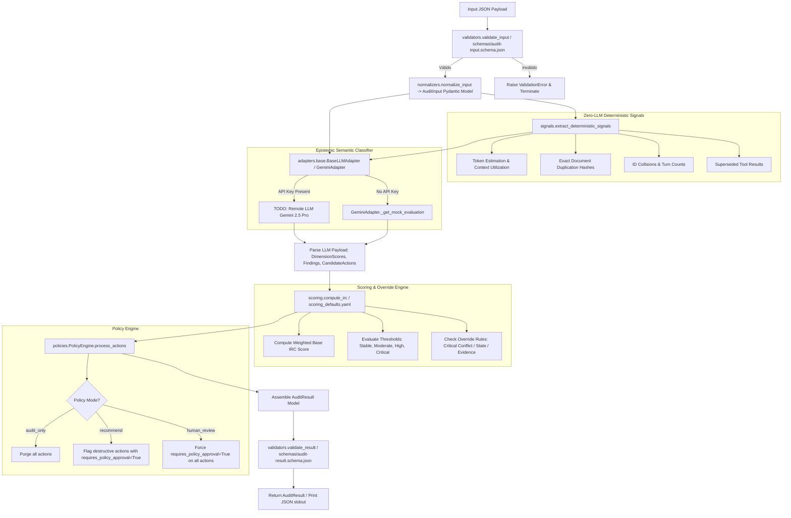

<!-- ============================================================================== -->
<!-- THINKINGSEED: ADN DEL PROYECTO (CONTEXTO PASIVO PARA MODELOS DE LENGUAJE)     -->
<!-- ============================================================================== -->
> [!NOTE]
> ### 🧬 DEFINICIÓN Y ROL DE ESTE DOCUMENTO
> 1. **¿Qué es este archivo?:** Este documento es una **Semilla de Proyecto (ThinkingSeed Master)**: representa el **ADN arquitectónico, técnico y estructural exhaustivo** del sistema. **NO es el repositorio completo de código fuente**, sino su mapa genético y memoria técnica profunda extraída directamente del entorno de desarrollo.
> 2. **Estado de Avance (Work in Progress):** Este documento refleja el **estado actual del desarrollo**. No garantiza que el proyecto esté concluido al 100%; puede representar un prototipo, un MVP o un sistema en evolución continua. La ausencia de código completo en ciertos archivos o módulos es **deliberada por diseño** para optimizar ventana de contexto o refleja áreas aún en desarrollo.
> 3. **Modo de Operación:** Trata este documento como **contexto pasivo de referencia técnica (Ground Truth)**. No asumas que el archivo está defectuoso ni intentes reescribirlo por tu cuenta.
<!-- ============================================================================== -->

# THINKING SEED MASTER: Context Entropy Auditor (CEA)

## 0. IDENTIDAD Y METADATOS
```yaml
seed_schema_version: "2.0"
project_name: "context-entropy-auditor"
repository_name: "Context Entropy Auditor (CEA)"
project_type: "library"
repository_mode: "single-project"
generated_at: "2026-09-05T15:59:30-04:00"
generated_by: "Antigravity (Gemini 3.8 Flash)"
repository_root: "d:/0001 HyperScale Thinking/PROYECTOS CLOUD/Research and Development/Context Entropy Auditor (CEA)"
git_branch: "master"
git_commit: "e92de60fbc799b429e432f0c50f00cfcbba52904"
working_tree_state: "dirty"
analysis_mode: "static"
coverage_level: "high"
known_analysis_limits:
  - "Inspección estática de código y esquemas sin ejecución de pruebas dinámicas (pytest no instalado en .venv local)."
  - "Integración viva con LLM Gemini no ejecutada en tiempo real; analizado a nivel de contrato estático y mock fallback en GeminiAdapter."
```

### 0.1 Instrucciones para el modelo receptor
1. **ADN vs Repositorio:** Reconoce este documento como la memoria técnica y el ADN del proyecto, no como el repositorio completo ni como una prueba de ejecución.
2. **Contexto Pasivo:** No generes código no solicitado ni reclames por archivos ausentes; espera instrucciones específicas del usuario o utilízalo como contexto pasivo para responder preguntas sobre el funcionamiento del sistema.
3. **Estado de Avance:** Considera que las secciones incompletas o componentes marcados como `[FALTANTE]` representan el avance real del proyecto y oportunidades de asistencia, no errores del documento.
4. **Evidencia:** Respeta las etiquetas de evidencia y no transformes inferencias en hechos.
5. **Rutas:** Antes de proponer cambios, identifica módulos y archivos afectados citando sus rutas exactas relativas al repositorio.
6. **Contratos:** Conserva arquitectura, convenciones, contratos y restricciones declaradas.
7. **Preguntas Dirigidas:** No inventes componentes ausentes. Formula preguntas solo cuando la incertidumbre impida una respuesta segura.
8. **Seguridad:** No reveles ni solicites secretos. Usa placeholders (`<REDACTED>`).
9. **Impacto:** Evalúa impactos laterales en pruebas, configuración, datos, seguridad, observabilidad y despliegue.
10. **Asistencia:** Distingue entre solución inmediata, deuda técnica y recomendación futura.

---

## 1. RESUMEN EJECUTIVO

### 1.1 Proyecto en una frase
`[CONFIRMADO]` Context Entropy Auditor (CEA) es un framework y herramienta de inspección out-of-band determinista y semántica para auditar, cuantificar y mitigar la degradación epistémica (entropía de contexto) en aplicaciones y agentes basados en Grandes Modelos de Lenguaje (LLMs).

### 1.2 Problema que resuelve
`[CONFIRMADO]` A medida que las sesiones de LLMs y agentes autónomos acumulan turnos de conversación, system prompts densos, documentos recuperados (RAG) y llamadas a herramientas (tools), el contexto sufre degradación epistémica: instrucciones contradictorias, pérdida de correferencias ("Lost-in-the-middle"), persistencia de restricciones obsoletas (Context Contamination) y deriva de estado en llamadas a herramientas. CEA resuelve la ausencia de un evaluador objetivo desacoplado de impresiones subjetivas ("vibes-based") mediante un cálculo matemático y semántico del Índice de Riesgo y Contaminación (IRC).

### 1.3 Usuarios o sistemas consumidores
`[CONFIRMADO]`
- **Ingenieros de Confiabilidad de Inferencia LLM / ML Engineers:** Que necesitan auditar flujos de agentes y pipelines RAG antes o después de la inferencia.
- **Orquestadores de Agentes Autónomos:** Sistemas de middleware o runtimes agénticos que consultan a CEA como "gatekeeper" antes de disparar acciones críticas o de persistencia.
- **Desarrolladores y Equipos de QA:** Mediante la interfaz de línea de comandos (`context-auditor`) para validar trazas de contexto almacenadas en formato JSON.

### 1.4 Alcance y límites del sistema
`[CONFIRMADO]`
- **Dentro del alcance:**
  - Normalización y validación estricta de payloads JSON según esquemas formales (`audit-input.schema.json`, `audit-result.schema.json`).
  - Extracción determinista de señales matemáticas sin LLM (conteos, duplicados exactos, colisiones de IDs, utilización de ventana, herramientas sustituidas).
  - Clasificación semántica epistémicamente acotada (dimensiones evaluadas en escala discreta 0, 25, 50, 75, 100).
  - Motor de scoring con pesos configurables (`scoring_defaults.yaml`) y reglas de anulación (*override rules*).
  - Motor de políticas (`PolicyEngine`) para filtrar acciones recomendadas y restringir operaciones destructivas.
  - CLI ejecutable `context-auditor`.
- **Fuera del alcance (Límites declarados):**
  - `[CONFIRMADO]` No mide estados mecánicos internos del LLM auditado (pesos de atención, activaciones neuronales, KV Cache real); el término "entropía" es una metáfora de fiabilidad, no una métrica de física estadística.
  - `[CONFIRMADO]` Las acciones automáticas destructivas (`auto_recover`) están deshabilitadas por defecto.
  - `[DECLARADO]` Modos multi-tenant, enrutamiento adaptativo de modelos y tableros gráficos (UI) están expresamente fuera del alcance a corto plazo según `ROADMAP.md`.

---

## 2. ARQUITECTURA Y TOPOLOGÍA

### 2.1 Estilo arquitectónico
`[CONFIRMADO]` Arquitectura modular dividida en tres capas secuenciales con patrón Adapter para el backend de lenguaje (Pipeline de Inspección Determinista + Semántica + Política):
1. **Capa 1: Extracción Determinista (Zero-LLM):** Ingesta, validación de esquema y cálculo de métricas heurísticas de texto y metadatos.
2. **Capa 2: Clasificación Semántica Acotada (LLM Adapter):** Evaluador semántico secundario operado bajo contrato epistémico estricto (etiquetas `observed`, `inferred`, `runtime_measured`, `unknown`).
3. **Capa 3: Motor de Scoring y Políticas (Policy Engine):** Cálculo de IRC (0-100), evaluación de umbrales, disparo de reglas de anulación y filtro de gobernanza de acciones de mitigación.

### 2.2 Árbol estructural del repositorio (excluyendo ruido)
```text
.
├── 001_Seed/
│   ├── ThinkingSeed_MasterHybrid.md            # Plantilla de referencia para seeds
│   └── seed-context-entropy-auditor-master.md  # Este archivo (ADN maestro)
├── 01_Status/                                  # [FALTANTE] Directorio corporativo reservado para tracking
├── Artefactos/
│   ├── 01 PLAN GPT 5.6 SOL THINKING/
│   │   ├── INSTRUCCION_MAESTRA_CONTEXT_ENTROPY_AUDITOR.md
│   │   └── implementation_plan.md
│   ├── Analisis de Planes/
│   │   ├── Analisis_y_Plan_Definitivo.md
│   │   ├── Plan_Optimizacion_GitHub.md
│   │   └── Plan_Utilidades_Avanzadas.md
│   ├── Fases/                                  # Documentación de hitos Inc0 a Inc7
│   │   ├── Inc0_Fundacion_Epistemica/ENTREGABLES.md
│   │   ├── Inc1_Prompt_Core/ENTREGABLES.md
│   │   ├── Inc2_Esquemas_Modelos/ENTREGABLES.md
│   │   ├── Inc3_Scoring_Engine/ENTREGABLES.md
│   │   ├── Inc4_Senales_Deterministas/ENTREGABLES.md
│   │   ├── Inc5_SDK_CLI/ENTREGABLES.md
│   │   ├── Inc6_Dataset_Evaluacion/ENTREGABLES.md
│   │   ├── Inc7_Publicacion/ENTREGABLES.md
│   │   └── README.md
│   └── Task del agente/
│       └── task.md
├── config/
│   └── scoring_defaults.yaml                   # Pesos, umbrales y reglas de anulación de scoring
├── data/
│   ├── processed/                              # [FALTANTE] Directorio reservado estructura Medallion
│   ├── raw/                                    # [FALTANTE] Directorio reservado fuentes inmutables
│   └── sandbox/                                # [FALTANTE] Directorio reservado experimentación
├── dataset/
│   ├── eval_dataset.jsonl                      # 5 casos etiquetados para validación de pipeline
│   └── self_audit.json                         # Caso de auditoría interna de contexto
├── docs/
│   ├── architecture/                           # [FALTANTE] Directorio reservado para diagramas
│   ├── engineers_notes/                        # [FALTANTE] Bitácoras de ingeniería y RCA
│   ├── technical_specs/                        # [FALTANTE] Especificaciones técnicas detalladas
│   ├── methodology.md                          # Metodología y principios epistémicos
│   ├── scoring.md                              # Especificación matemática del IRC y rubricas
│   └── terminology.md                          # Glosario técnico formal
├── Engine/
│   └── EngineReadme.md                         # Manifiesto corporativo de gobernanza de directorios
├── examples/
│   ├── ambiguous-task.json                     # Caso de prueba: tarea con meta no especificada
│   ├── contaminated-context.json               # Caso de prueba: fuga de contexto de tareas previas
│   ├── healthy-conversation.json               # Caso de prueba: conversación óptima/estable
│   ├── instruction-conflict.json               # Caso de prueba: conflicto explícito de directivas
│   └── tool-state-drift.json                   # Caso de prueba: inconsistencia en salidas de herramientas
├── infrastructure/                             # [FALTANTE] Directorio reservado IaC (Terraform/CDK)
├── logs/                                       # [FALTANTE] Directorio de trazas de ejecución locales
├── Notebooks/                                  # [FALTANTE] Directorio de análisis exploratorio
├── prompts/
│   ├── auditor-simple-en.md                    # Prompt evaluador simple (inglés)
│   ├── auditor-simple-es.md                    # Prompt evaluador simple (español)
│   ├── auditor-technical-en.md                 # Prompt evaluador técnico estricto (inglés)
│   ├── auditor-technical-es.md                 # Prompt evaluador técnico estricto (español)
│   └── v0-original.md                          # Prompt fundacional de referencia histórica
├── schemas/
│   ├── audit-input.schema.json                 # JSON Schema borrador 7 para entradas a auditar
│   └── audit-result.schema.json                # JSON Schema borrador 7 para reporte de auditoría
├── scripts/
│   ├── Context Entropy Auditor.md              # Script/prompt inyectable original
│   └── evaluate.py                             # Script de evaluación sobre eval_dataset.jsonl
├── src/
│   ├── context_auditor/
│   │   ├── __init__.py                         # Metadatos del paquete Python
│   │   ├── adapters/
│   │   │   ├── base.py                         # Clase abstracta BaseLLMAdapter
│   │   │   └── gemini.py                       # Implementación concreta Gemini (mock/prod)
│   │   ├── normalizers/
│   │   │   └── __init__.py                     # Función normalize_input con validación JSON Schema
│   │   ├── auditor.py                          # Orquestador principal ContextAuditor
│   │   ├── cli.py                              # Entry point de terminal (argparse)
│   │   ├── models.py                           # Modelos de datos Pydantic v2 (Input & Result)
│   │   ├── policies.py                         # Motor de políticas y modos de autorización
│   │   ├── scoring.py                          # Cálculo numérico del IRC y reglas de override
│   │   ├── signals.py                          # Extracción determinista de señales matemáticas
│   │   └── validators.py                       # Validadores JSON Schema independientes
│   ├── data_generation/                        # [FALTANTE] Directorio reservado generación sintética
│   └── fabric_jobs/                            # [FALTANTE] Directorio reservado jobs Microsoft Fabric
├── tests/
│   ├── e2e/
│   │   └── test_cli.py                         # Pruebas de integración del comando CLI
│   └── unit/
│       ├── test_normalizers.py                 # Pruebas de normalización de payloads
│       ├── test_policies.py                    # Pruebas de filtrado de políticas y modos
│       ├── test_scoring.py                     # Pruebas del algoritmo de cálculo de IRC
│       ├── test_signals.py                     # Pruebas de conteos y heurísticas matemáticas
│       └── test_validators.py                  # Pruebas de conformidad con JSON Schema
├── .gitignore
├── CONTRIBUTING.md                             # Guía de contribución comunitaria
├── Context Entropy Auditor.md                  # Copia en raíz del prompt inyectable original
├── LICENSE                                     # Licencia MIT
├── pyproject.toml                              # Configuración de empaquetado y dependencias pip
├── README.md                                   # Documentación ejecutiva y técnica principal
└── ROADMAP.md                                  # Hoja de ruta por versiones
```

### 2.3 Responsabilidad por directorio y archivo clave
`[CONFIRMADO]`
- **`src/context_auditor/auditor.py`**: Orquestador central. Encadena `normalize_input`, `extract_deterministic_signals`, invocación a `llm_adapter.evaluate_context`, `compute_irc`, filtrado en `policy_engine` y ensamblado del `AuditResult`.
- **`src/context_auditor/models.py`**: Declaración de entidades Pydantic v2. Modela entradas (`AuditInput`, `Message`, `Document`, `ToolEvent`, `Role`) y salidas (`AuditResult`, `OverallStatus`, `EpistemicStatus`, `DimensionScores`, `Finding`, `RecommendedAction`, `AuditScope`).
- **`src/context_auditor/scoring.py`**: Carga dinámicamente `config/scoring_defaults.yaml`. Implementa `compute_base_status` e interpreta dimensiones ponderadas y reglas de anulación.
- **`src/context_auditor/signals.py`**: Lógica 100% matemática libre de LLM: estimación de tokens (longitud / 4), conteo de turnos, ratio de uso de contexto, duplicidad exacta de documentos (hashes), verificación de unicidad de IDs y detección de sobreescritura de resultados de herramientas.
- **`src/context_auditor/policies.py`**: Implementa `PolicyEngine` con 4 modos (`audit_only`, `recommend`, `human_review`, `dry_run`). Garantiza que acciones con bandera `destructive=True` exijan siempre `requires_policy_approval=True`.
- **`src/context_auditor/validators.py`**: Envoltura sobre librería `jsonschema` para contrastar dicts crudos contra `schemas/audit-input.schema.json` y `schemas/audit-result.schema.json`.
- **`src/context_auditor/adapters/`**: Capa de abstracción. `base.py` define la firma contractual; `gemini.py` encapsula la interacción con Google Gemini, proveyendo un mock determinista cuando no se detecta `GEMINI_API_KEY`.
- **`schemas/`**: Esquemas JSON formales que rigen la interoperabilidad entre lenguajes y clientes externos.
- **`config/scoring_defaults.yaml`**: Parámetros de pesos por dimensión (suma = 1.0) y umbrales de corte (0-24.99 Stable, 25-49.99 Moderate, 50-74.99 High, 75-100 Critical).
- **`Engine/EngineReadme.md`**: Define el estándar de directorios corporativos HyperScale (por qué existen carpetas reservadas como `data/`, `infrastructure/`, `fabric_jobs/`).

### 2.4 Límites modulares y acoplamiento
`[CONFIRMADO]`
- Desacoplamiento total entre el cómputo de señales deterministas (`signals.py`) y el motor de inferencia semántica (`adapters/`).
- Las dependencias externas en tiempo de ejecución del core se limitan estrictamente a: `pydantic`, `jsonschema`, `pyyaml`.
- El subsistema de scoring depende de la configuración externa en YAML, permitiendo recalibrar pesos sin recompilar ni alterar el código Python.

---

## 3. FLUJOS DE EJECUCIÓN Y ENTRY POINTS

### 3.1 Puntos de entrada principales (CLI, HTTP, Jobs, Eventos)
`[CONFIRMADO]`
- **Consola / CLI (`context-auditor`):** Declarado en `pyproject.toml` vinculando a `src.context_auditor.cli:main`.
  - Parámetros: `input_file` (posicional), `--policy [audit_only|recommend|human_review|dry_run]`, `--factual` (flag booleano).
  - Emisión: JSON formateado a `stdout`; mensajes diagnósticos a `stderr`.
- **SDK Programático en Python:** Invocación directa importando `ContextAuditor` desde `src.context_auditor.auditor`.
- **Script de Evaluación por Lotes:** `python scripts/evaluate.py` procesa `dataset/eval_dataset.jsonl`.
- `[FALTANTE]` No existen endpoints HTTP (FastAPI/Flask) ni eventos/jobs de colas implementados en esta versión.

### 3.2 Diagrama de flujo principal E2E


### 3.3 Ciclo de vida de la ejecución y estados
`[CONFIRMADO]`
1. **Validación:** El JSON crudo debe pasar la validación estricta de JSON Schema; de lo contrario, se interrumpe de inmediato.
2. **Normalización:** Los campos opcionales son poblados con valores por defecto (listas vacías para documentos y herramientas).
3. **Señalización:** Se computan métricas inmutables basadas en conteos y strings.
4. **Clasificación:** El LLM evalúa semánticamente el flujo bajo un prompt con contrato epistémico estricto (o genera el mock si está desconectado).
5. **Calibración y Ponderación:** Se combinan las dimensiones evaluadas con los pesos en YAML y se ejecutan los disparadores de anulación (`triggered_rules`).
6. **Filtrado de Gobernanza:** Se aplican restricciones sobre las acciones sugeridas según la política activa.
7. **Certificación de Salida:** Se valida que el modelo de resultado cumpla con `audit-result.schema.json` antes de ser retornado o impreso.

---

## 4. MODELO DE DATOS, CONTRATOS Y PERSISTENCIA

### 4.1 Esquemas y entidades principales
`[CONFIRMADO]`

#### Entidades de Entrada (`AuditInput`):
- `Message`: `id: str`, `role: Role (system|user|assistant|tool)`, `content: str`, `timestamp: Optional[datetime]`.
- `Document`: `id: str`, `content: str`, `source: Optional[str]`, `confidence: Optional[float] (0.0-1.0)`.
- `ToolEvent`: `id: str`, `tool_name: str`, `parameters: Dict[str, Any]`, `result: str`, `timestamp: Optional[datetime]`.
- `AuditInput`: `schema_version: str`, `messages: List[Message]`, `documents: List[Document]`, `tool_events: List[ToolEvent]`, `runtime_telemetry: Dict[str, Any]`, `audit_configuration: Dict[str, Any]`.

#### Entidades de Salida (`AuditResult`):
- `OverallStatus (Enum)`: `stable` | `moderate` | `high` | `critical`.
- `EpistemicStatus (Enum)`: `observed` | `inferred` | `runtime_measured` | `unknown`.
- `DimensionScores`:
  - `instruction_conflict: int (0|25|50|75|100)`
  - `task_ambiguity: int (0|25|50|75|100)`
  - `context_contamination: int (0|25|50|75|100)`
  - `evidence_quality: int (0|25|50|75|100)`
  - `state_integrity: int (0|25|50|75|100)`
  - `redundancy_pressure: int (0|25|50|75|100)`
- `Finding`: `finding_id: str`, `dimension: str`, `epistemic_status: EpistemicStatus`, `severity: int`, `evidence_refs: List[str]`, `explanation: str`, `confidence: Optional[float]`.
- `RecommendedAction`: `action: str`, `target_refs: List[str]`, `reason: str`, `requires_policy_approval: bool`, `destructive: bool`.
- `AuditResult`: `schema_version: str`, `audit_version: Optional[str]`, `audit_id: str`, `overall_status: OverallStatus`, `risk_score: float (0.0-100.0)`, `confidence: float (0.0-1.0)`, `evidence_coverage: float (0.0-1.0)`, `scope: Optional[AuditScope]`, `dimension_scores: DimensionScores`, `findings: List[Finding]`, `recommended_actions: List[RecommendedAction]`, `triggered_rules: List[str]`, `limitations: List[str]`.

### 4.2 Almacenamiento, motores de base de datos y migraciones
`[CONFIRMADO]`
- No existe base de datos relacional ni motor SQL/NoSQL en la arquitectura actual. El sistema opera como un procesador de datos stateless en memoria (in-memory pipeline).
- `[DECLARADO]` Los directorios `data/raw`, `data/processed` y `data/sandbox` forman parte del estándar de arquitectura Medallion empresarial para futuras etapas de captura masiva o generación sintética, pero actualmente están vacíos.

### 4.3 Interfaces externas, payloads y contratos de API
`[CONFIRMADO]`
- Contrato de entrada: `schemas/audit-input.schema.json` (JSON Schema Draft-07).
- Contrato de salida: `schemas/audit-result.schema.json` (JSON Schema Draft-07).
- Conexión Externa: Google GenAI API (vía `GeminiAdapter`, pendiente de instanciación con cliente SDK real).

---

## 5. CONFIGURACIÓN Y AMBIENTE

### 5.1 Tabla de variables de entorno
| Variable | Tipo | Default | Efecto | Sensible |
| :--- | :--- | :--- | :--- | :--- |
| `GEMINI_API_KEY` | `str` | `None` | `[CONFIRMADO]` Clave de autenticación para invocar la API de Google Gemini. Si no está presente, `GeminiAdapter` conmuta silenciosamente a modo mock. | **SÍ** |
| `PYTHONPATH` | `str` | `None` | `[CONFIRMADO]` Necesario durante ejecución directa de scripts o tests en desarrollo para resolver el paquete raíz `src`. | No |

### 5.2 Perfiles de ejecución (dev, test, prod)
`[CONFIRMADO]`
- **Modo Desarrollo / Test (Offline / Mock):** Cuando `GEMINI_API_KEY` está ausente, el adaptador retorna puntuaciones neutras (`risk_score = 0.0`, `status = stable`), permitiendo validar pipelines, schemas y lógica de normalización sin incurrir en costes de API ni requerir conexión externa.
- **Modo Producción / Evaluación Real:** Al configurar `GEMINI_API_KEY`, se prevé la conexión al modelo `gemini-2.5-pro` para la auditoría semántica real.
- `[CONFIRMADO]` Configuración declarativa en `config/scoring_defaults.yaml`:
  - Pesos de dimensiones (conflict: 0.20, ambiguity: 0.20, contamination: 0.20, evidence: 0.15, state: 0.15, redundancy: 0.10).
  - Umbrales de severidad (stable <= 24.99, moderate <= 49.99, high <= 74.99, critical <= 100.0).

### 5.3 Prerrequisitos de sistema e infraestructura
`[CONFIRMADO]`
- Python: Versión `>= 3.9` (especificado en `pyproject.toml`).
- Dependencias mínimas del sistema:
  - `pydantic >= 2.0.0`
  - `jsonschema >= 4.0.0`
  - `pyyaml >= 6.0`
- Dependencias opcionales de desarrollo:
  - `pytest >= 7.0.0`

---

## 6. PRUEBAS, CI/CD Y OPERACIÓN

### 6.1 Estrategia de pruebas (unitarias, integración, e2e)
`[CONFIRMADO]`
- **Pruebas Unitarias (`tests/unit/`):**
  - `test_scoring.py`: Verifica cálculo matemático del IRC, puntuación perfecta (0.0), puntuación moderada y reglas de anulación (`critical_conflict_high_risk`, `critical_evidence_critical_risk`, `low_coverage_warning`).
  - `test_signals.py`: Valida cálculo determinista de tokens, conteo de turnos, hashes de duplicidad exacta, colisiones de IDs y sobreescrituras de herramientas.
  - `test_policies.py`: Verifica comportamiento de modos `audit_only`, `recommend` (flag destructivo fuerza aprobación) y `human_review` (fuerza aprobación en todos).
  - `test_validators.py`: Comprueba que payloads válidos e inválidos sean aceptados o rechazados por `validate_input` y `validate_result`.
  - `test_normalizers.py`: Prueba la conversión de dict a modelo tipado `AuditInput`.
- **Pruebas End-to-End (`tests/e2e/`):**
  - `test_cli.py`: Ejecuta el módulo CLI vía subproceso (`python -m src.context_auditor.cli`) contra archivos de prueba en `examples/` y valida código de retorno y formato JSON en stdout.
- **Suite de Evaluación (`scripts/evaluate.py`):**
  - Itera sobre las 5 instancias etiquetadas en `dataset/eval_dataset.jsonl` verificando que no ocurran excepciones no controladas.

### 6.2 Automatización y pipelines CI/CD
`[FALTANTE]` No se observan archivos de GitHub Actions (`.github/workflows/`), GitLab CI ni Azure Pipelines en el repositorio actualmente.

### 6.3 Contenedores y orquestación (Docker, Kubernetes, etc.)
`[FALTANTE]` No existen `Dockerfile`, `docker-compose.yml` ni manifiestos Kubernetes en el estado actual del repositorio.

---

## 7. OBSERVABILIDAD Y MODOS DE FALLA

### 7.1 Logs, métricas y tracing
`[CONFIRMADO]`
- Registro de errores básico en `cli.py` emitiendo trazas por `sys.stderr`.
- Los resultados de cada auditoría incluyen trazabilidad granular mediante campos dedicados: `audit_id` (UUIDv4 acortado), `audit_version`, `scope` (turnos y documentos observados) y `limitations` explícitas.
- `[FALTANTE]` No hay integración con `logging` nativo de Python, OpenTelemetry ni exportadores Prometheus. El directorio `logs/` se encuentra vacío.

### 7.2 Modos de falla conocidos y estrategias de recuperación
`[CONFIRMADO]`
1. **Falla de Esquema de Entrada:** Si el JSON carece de campos obligatorios (como `messages`), `validate_input` genera `jsonschema.ValidationError` y aborta inmediatamente para evitar inferencias sobre estructuras corruptas.
2. **Falta de Credenciales LLM:** `GeminiAdapter` detecta la ausencia de `GEMINI_API_KEY` y conmuta a mock transparente, documentando en `limitations` que se empleó una evaluación simulada.
3. **Baja Cobertura de Evidencia:** Si `evidence_coverage < 0.30`, la regla `low_coverage_warning` impide automáticamente que el estado global sea clasificado como `stable`, degradándolo a `moderate`.
4. **Ambigüedad de Documentos Idénticos:** `signals.py` captura duplicados exactos mediante almacenamiento de hashes de texto en `content_hashes`.

### 7.3 Idempotencia y reintentos
`[CONFIRMADO]`
- El proceso de auditoría es **100% idempotente** y puramente funcional: ante la misma entrada y las mismas respuestas del adaptador semántico, el cálculo de señales deterministas y el scoring producen exactamente el mismo resultado.
- `[FALTANTE]` No se han implementado políticas de reintentos exponenciales (*exponential backoff*) ante caídas de la API externa del LLM.

---

## 8. SEGURIDAD Y PRIVACIDAD

### 8.1 Hallazgos de seguridad estática
`[CONFIRMADO]`
- **Análisis de Secretos:** No se identificaron claves API, tokens de servicio ni credenciales hardcodeadas en el código fuente ni en los archivos de configuración (`scoring_defaults.yaml`).
- **Inyección de Comandos:** El módulo `cli.py` no ejecuta sentencias shell arbitrarias (`eval`, `exec` o `os.system`). El subproceso en `tests/e2e/test_cli.py` utiliza listas seguras de argumentos sin `shell=True`.

### 8.2 Manejo de autenticación, autorización y secretos
`[CONFIRMADO]`
- La autenticación con el proveedor LLM se delega en la variable de entorno estándar `GEMINI_API_KEY`.
- El framework cuenta con control de gobernanza a través de `PolicyEngine`: ninguna acción recomendada con capacidad destructiva sobre la memoria o el contexto puede ser ejecutada sin consentimiento explícito (`requires_policy_approval: true`).

### 8.3 Privacidad de datos y cumplimiento
`[CONFIRMADO]`
- El payload procesado contiene potencialmente textos completos de conversaciones de usuarios y documentos confidenciales. Cuando se active el adaptador de producción, dichos datos serán transmitidos al proveedor de inferencia (Google Gemini).
- `[FALTANTE]` No existe actualmente un módulo de enmascaramiento o anonimización previa (PII redaction) antes del envío al adaptador LLM.

---

## 9. ESTADO REAL, DEUDA TÉCNICA Y LIMITACIONES

### 9.1 Nivel de madurez y avance real del proyecto
`[CONFIRMADO]`
- El núcleo algorítmico, los modelos Pydantic, los esquemas JSON de entrada/salida, la extracción de señales deterministas, el motor de scoring ponderado y el CLI se encuentran implementados y probados mediante suites unitarias y e2e.
- Nivel de madurez: **Prototipo funcional avanzado / MVP (Beta)**, listo para integración con el SDK de producción de Gemini.

### 9.2 Deuda técnica identificada y stubs pendientes
`[CONFIRMADO]`
1. **Llamada Real a Gemini Pendiente:** En `src/context_auditor/adapters/gemini.py`, el método `evaluate_context` tiene pendiente la integración con el SDK oficial (`google-genai`), arrojando `NotImplementedError` si se provee una clave API.
2. **Directorios Reservados Vacíos (Stubs HyperScale):**
   - `src/data_generation/` `[FALTANTE]`
   - `src/fabric_jobs/` `[FALTANTE]`
   - `01_Status/` `[FALTANTE]`
   - `Tools/` `[FALTANTE]`
   - `infrastructure/` `[FALTANTE]`
   - `logs/` `[FALTANTE]`
   - `Notebooks/` `[FALTANTE]`
   - `data/raw/`, `data/processed/`, `data/sandbox/` `[FALTANTE]`
   - `docs/architecture/`, `docs/engineers_notes/`, `docs/technical_specs/` `[FALTANTE]`
3. **Entorno Virtual Desincronizado:** El `.venv` local del espacio de trabajo no tiene instalados los paquetes (`pytest`, `pydantic`, etc.), impidiendo la ejecución directa de la suite de pruebas desde ese intérprete sin previo `pip install -e .`.
4. **Dataset de Evaluación Reducido:** `dataset/eval_dataset.jsonl` contiene 5 casos de prueba, lejos de los 30-50 casos proyectados en la hoja de ruta para la calibración estadística final.

### 9.3 Inconsistencias entre código y documentación
`[CONFIRMADO]`
- **Discrepancia de Versión:**
  - `pyproject.toml` declara: `version = "0.5.0"`.
  - `src/context_auditor/__init__.py` declara: `__version__ = "0.1.0"`.
  - `src/context_auditor/auditor.py` (Línea 47) hardcodea: `audit_version="0.1.0"`.
  - `ROADMAP.md` marca las versiones `v0.1-alpha` hasta `v0.5-public` como `⏳ Planned`, a pesar de que el código correspondiente a Inc 0 hasta Inc 5 ya está materializado en `src/`.
- **Nombres de Métricas en Documentación vs Código:** En algunos prompts y notas preliminares se hacía referencia a "Context Risk Score (CRS)", mientras que en los modelos y código fuente se unificó como "Index of Risk and Contamination (IRC)" y campo `risk_score`.

---

## 10. REGLAS PARA MODIFICAR EL PROYECTO

### 10.1 Convenciones de estilo, linting y tipado
`[CONFIRMADO]`
- Código escrito en **Python 3.9+**.
- Tipado estático obligatorio en firmas públicas utilizando `typing` y modelos Pydantic v2.
- Nomenclatura PEP 8: funciones y variables en `snake_case`, clases en `PascalCase`, constantes en `UPPER_SNAKE_CASE`.
- Código y nombres de símbolos exclusivamente en **inglés**; documentación y prompts disponibles en **inglés y español**.

### 10.2 Reglas arquitectónicas inviolables
`[CONFIRMADO]`
1. **Aislamiento de Señales:** Las señales deterministas de `signals.py` deben derivarse estrictamente de matemáticas y comprobaciones de strings, **sin intervención de ningún LLM**.
2. **Contrato Epistémico del Evaluador:** El evaluador semántico jamás debe conjeturar estados mecanicistas internos (atención, activaciones, tensores). Cada hallazgo debe estar clasificado como `observed`, `inferred`, `runtime_measured` o `unknown`.
3. **Inmutabilidad de Esquemas:** Cualquier cambio en la estructura de datos requiere actualizar simultáneamente los modelos Pydantic en `models.py` y los archivos JSON Schema en `schemas/`.
4. **Principio de Mínimo Privilegio en Acciones:** Ninguna acción catalogada como destructiva (`destructive: true`) puede ejecutarse de forma autónoma sin bandera de aprobación de política.
5. **Declaratividad del Scoring:** Las fórmulas y pesos del cálculo del IRC deben residir en `config/scoring_defaults.yaml` y no hardcodeadas en funciones de Python.

### 10.3 Checklist de verificación previa a commit
- [ ] Validar que `pyproject.toml`, `__init__.py` y `audit_version` mantengan consistencia de versionado.
- [ ] Ejecutar validación de esquemas contra todos los ejemplos en `examples/`.
- [ ] Asegurar que no se introduzcan claves API ni credenciales hardcodeadas en ningún archivo.
- [ ] Comprobar que los tests unitarios en `tests/unit/` y e2e en `tests/e2e/` pasen al 100%.
- [ ] Verificar que no queden importaciones circulares entre `models`, `validators` y `auditor`.

---

## 📌 CONTEXT HANDOFF & PROTOCOLO DE ASISTENCIA

> **Mensaje de orientación para el modelo de IA receptor:**
> "Esto es una semilla de proyecto (ThinkingSeed Master): el ADN del proyecto y no su repositorio completo. Refleja el avance real y la arquitectura del sistema hasta la fecha. Como modelo receptor, tu función es usar esta semilla como memoria técnica para:
> 1. **Responder preguntas** sobre la arquitectura, funcionamiento, dependencias y flujos del sistema.
> 2. **Sugerir mejoras o asistencia técnica** sobre el estado actual y áreas pendientes identificadas en la semilla.
> 3. **Generar código o soluciones compatibles** respetando las rutas, convenciones y patrones definidos aquí, cuando el usuario te lo solicite."

### Pautas de resolución:
Antes de resolver una solicitud:
1. Identifica el objetivo del usuario.
2. Localiza los componentes afectados usando las rutas del Seed.
3. Revisa restricciones, reglas y contratos declarados.
4. Explicita supuestos cuando sea necesario: "Supongo que X debido a Y".
5. Propone cambios por archivo con rutas claras.
6. Añade pruebas, riesgos y criterios de aceptación.

### 🤝 Acuse de Recibo Inicial
Si el usuario adjuntó esta semilla **sin una instrucción específica**, no intentes generar código ni completar archivos vacíos. Responde únicamente con:
1. Un saludo confirmando que asimilaste el ADN de **Context Entropy Auditor (CEA)** y su stack principal.
2. Un breve resumen de 2-3 líneas sobre el objetivo y su estado actual de avance.
3. Una frase poniéndote a disposición para resolver dudas sobre su funcionamiento o colaborar en los siguientes pasos de desarrollo.
