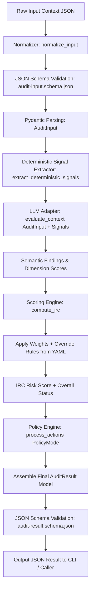

<!-- ============================================================================== -->
<!-- THINKINGSEED: ADN DEL PROYECTO (CONTEXTO PASIVO PARA MODELOS DE LENGUAJE)     -->
<!-- ============================================================================== -->
> [!NOTE]
> ### 🧬 DEFINICIÓN Y ROL DE ESTE DOCUMENTO
> 1. **¿Qué es este archivo?:** Este documento es una **Semilla de Proyecto (ThinkingSeed Master)**: representa el **ADN arquitectónico, técnico y estructural exhaustivo** del sistema. **NO es el repositorio completo de código fuente**, sino su mapa genético y memoria técnica profunda extraída directamente del entorno de desarrollo.
> 2. **Estado de Avance (Work in Progress):** Este documento refleja el **estado actual del desarrollo**. No garantiza que el proyecto esté concluido al 100%; puede representar un prototipo, un MVP o un sistema en evolución continua. La ausencia de código completo en ciertos archivos o módulos es **deliberada por diseño** para optimizar ventana de contexto o refleja áreas aún en desarrollo.
> 3. **Modo de Operación:** Trata este documento como **contexto pasivo de referencia técnica (Ground Truth)**. No asumas que el archivo está defectuoso ni intentes reescribirlo por tu cuenta.
<!-- ============================================================================== -->

# THINKING SEED MASTER: Context Entropy Auditor (CEA)

## 0. IDENTIDAD Y METADATOS
```yaml
seed_schema_version: "2.0"
project_name: "Context Entropy Auditor (CEA)"
repository_name: "ContextEntropy-Auditor"
project_type: "library"
repository_mode: "single-project"
generated_at: "2026-09-14T22:04:00-03:00"
generated_by: "Antigravity (Advanced Agentic Assistant) / Gemini 3.7 Flash"
repository_root: "d:/0001 HyperScale Thinking/PROYECTOS CLOUD/Research and Development/Context Entropy Auditor (CEA)"
git_branch: "master"
git_commit: "1511328ec2fa21901967b013556dd65b18287b18"
working_tree_state: "dirty"
analysis_mode: "static"
coverage_level: "high"
known_analysis_limits:
  - "Inspección estática profunda de código fuente Python, esquemas JSON y documentación metodológica."
  - "El adaptador GeminiAdapter se encuentra actualmente en modo Mock funcional para pruebas operativas locales; el cliente google-genai real requiere aprovisionamiento de API Key y entorno de ejecución online."
  - "Ambiente virtual local (.venv) requiere instalación de suite de pruebas pytest para ejecución automatizada en runtime."
```

### 0.1 Instrucciones para el modelo receptor
1. **ADN vs Repositorio:** Reconoce este documento como la memoria técnica y el ADN del proyecto, no como el repositorio completo ni como una prueba de ejecución.
2. **Contexto Pasivo:** No generes código no solicitado ni reclames por archivos ausentes; espera instrucciones específicas del usuario o utilízalo como contexto pasivo para responder preguntas sobre el funcionamiento del sistema.
3. **Estado de Avance:** Considera que las secciones incompletas o componentes marcados como `[FALTANTE]` representan el avance real del proyecto y oportunidades de asistencia, no errores del documento.
4. **Evidencia:** Respeta las etiquetas de evidencia (`[CONFIRMADO]`, `[INFERIDO]`, `[DECLARADO]`, `[NO VERIFICADO]`, `[FALTANTE]`) y no transformes inferencias en hechos.
5. **Rutas:** Antes de proponer cambios, identifica módulos y archivos afectados citando sus rutas exactas relativas al repositorio.
6. **Contratos:** Conserva arquitectura, convenciones, contratos y restricciones declaradas.
7. **Preguntas Dirigidas:** No inventes componentes ausentes. Formula preguntas solo cuando la incertidumbre impida una respuesta segura.
8. **Seguridad:** No reveles ni solicites secretos. Usa placeholders (`<REDACTED>`).
9. **Impacto:** Evalúa impactos laterales en pruebas, configuración, datos, seguridad, observabilidad y despliegue.
10. **Asistencia:** Distingue entre solución inmediata, deuda técnica y recomendación futura.

---

## 1. RESUMEN EJECUTIVO
- **1.1 Proyecto en una frase:** `[CONFIRMADO]` Context Entropy Auditor (CEA) es un framework y motor de auditoría epistemológica de confiabilidad y entropía contextual para aplicaciones basadas en Modelos de Lenguaje (LLMs), agentes conversacionales y arquitecturas RAG.
- **1.2 Problema que resuelve:** `[CONFIRMADO]` Mitiga y diagnostica fallos críticos de inferencia de Capa L5 (observabilidad de inferencia y ciclo de vida de contexto) tales como conflicto de instrucciones, ambigüedad en la tarea, contaminación contextual, degradación de evidencia, pérdida de integridad del estado agéntico y presión por redundancia/ruido en la ventana de contexto.
- **1.3 Usuarios o sistemas consumidores:** `[CONFIRMADO]` Ingenieros de confiabilidad de IA (LLM SREs / Reliability Engineers), plataformas de agentes autónomos, pipelines de orquestación de prompts/RAG y evaluadores de calidad contextual previa a la inferencia.
- **1.4 Alcance y límites del sistema:** `[CONFIRMADO]` 
  - **En alcance (MVP v0.5):** Extracción de señales deterministas libres de sesgo, cálculo calibrado de IRC (Índice de Riesgo Contextual / CRS), validación estricta de esquemas JSON Draft-07, motor de políticas de remediación (`PolicyEngine`) y CLI ejecutable.
  - **Límites epistemológicos:** `[CONFIRMADO]` CEA prohíbe taxativamente la confabulación mecanicista; no pretende acceder a pesos internos, logits ni estados de KV-Cache físicos del LLM, evaluando exclusivamente evidencia textual observable y métricas de runtime medibles.
  - **Fuera de alcance cercano:** `[DECLARADO]` Modos `auto_recover` no supervisados, políticas multi-tenant enterprise y compresión adaptativa en tiempo real (diferidos según `ROADMAP.md`).

---

## 2. ARQUITECTURA Y TOPOLOGÍA
- **2.1 Estilo arquitectónico:** `[CONFIRMADO]` Arquitectura modular orientada a tuberías de auditoría (Pipeline-based Modular Engine) con separación desacoplada entre:
  1. *Capa de Ingesta y Normalización* (`normalizers`, `validators`).
  2. *Capa de Señales Deterministas* (`signals` - libre de LLM).
  3. *Capa de Adaptación Semántica* (`adapters` - LLM evaluation).
  4. *Capa de Ponderación y Reglas de Anulación* (`scoring` - cálculo IRC).
  5. *Capa de Gobierno y Políticas* (`policies` - PolicyEngine).
  6. *Capa de Interfaces* (`cli`, Python SDK).

- **2.2 Árbol estructural del repositorio (excluyendo ruido):** `[CONFIRMADO]`
```
Context Entropy Auditor (CEA)/
├── .gitignore
├── CONTRIBUTING.md
├── Context Entropy Auditor.md       # Prompt inyectable original / Especificación base
├── Entropy.jpeg                     # Diagrama conceptual / visual
├── LICENSE
├── ROADMAP.md                       # Plan de releases y directrices de alcance
├── pyproject.toml                   # Manifiesto de empaquetado Python y dependencias
├── 001_Seed/                        # Repositorio de semillas arquitectónicas (ThinkingSeed)
│   └── seed-context-entropy-auditor-master.md
├── Artefactos/                      # Documentación y planes de evolución técnica
│   ├── 01 PLAN GPT 5.6 SOL THINKING/
│   │   ├── implementation_plan.md
│   │   └── INSTRUCCION_MAESTRA_CONTEXT_ENTROPY_AUDITOR.md
│   ├── Analisis de Planes/
│   │   ├── Analisis_y_Plan_Definitivo.md
│   │   ├── Plan_Optimizacion_GitHub.md
│   │   └── Plan_Utilidades_Avanzadas.md
│   ├── Fases/
│   │   ├── README.md
│   │   ├── Inc0_Fundacion_Epistemica/ENTREGABLES.md
│   │   ├── Inc1_Prompt_Core/ENTREGABLES.md
│   │   ├── Inc2_Esquemas_Modelos/ENTREGABLES.md
│   │   ├── Inc3_Scoring_Engine/ENTREGABLES.md
│   │   ├── Inc4_Senales_Deterministas/ENTREGABLES.md
│   │   ├── Inc5_SDK_CLI/ENTREGABLES.md
│   │   ├── Inc6_Dataset_Evaluacion/ENTREGABLES.md
│   │   └── Inc7_Publicacion/ENTREGABLES.md
│   └── Task del agente/task.md
├── config/
│   └── scoring_defaults.yaml        # Ponderaciones provisionales, umbrales y override rules
├── dataset/
│   ├── eval_dataset.jsonl           # Dataset de evaluación con casos etiquetados
│   └── self_audit.json              # Muestra de auto-auditoría
├── docs/
│   ├── methodology.md               # Metodología y principios epistemológicos
│   ├── scoring.md                   # Modelo matemático y rúbricas del IRC
│   └── terminology.md               # Taxonomía y definiciones formales de fallos
├── Engine/
│   └── EngineReadme.md              # Documentación de motor y orquestación
├── examples/                        # Casos de prueba de contexto estructurado
│   ├── ambiguous-task.json
│   ├── contaminated-context.json
│   ├── healthy-conversation.json
│   ├── instruction-conflict.json
│   └── tool-state-drift.json
├── prompts/                         # Plantillas de prompt para auditoría semántica
│   ├── auditor-simple-en.md
│   ├── auditor-simple-es.md
│   ├── auditor-technical-en.md
│   ├── auditor-technical-es.md
│   └── v0-original.md
├── schemas/                         # Contratos formales JSON Schema (Draft-07)
│   ├── audit-input.schema.json
│   └── audit-result.schema.json
├── scripts/
│   ├── Context Entropy Auditor.md
│   └── evaluate.py                  # Script de evaluación de datasets de auditoría
├── src/
│   └── context_auditor/
│       ├── __init__.py              # Exportaciones públicas de API
│       ├── auditor.py               # Orquestador principal ContextAuditor
│       ├── cli.py                   # Interfaz de línea de comandos
│       ├── models.py                # Modelos Pydantic v2 (AuditInput, AuditResult, etc.)
│       ├── policies.py              # Motor de políticas y gobierno de acciones
│       ├── scoring.py               # Algoritmo de cálculo de IRC y reglas de anulación
│       ├── signals.py               # Extractor de señales heurísticas deterministas
│       ├── validators.py            # Validadores de conformidad con esquemas JSON
│       ├── adapters/
│       │   ├── base.py              # Interfaz abstracta BaseLLMAdapter
│       │   └── gemini.py            # Adaptador para Google Gemini API (Mock / Real)
│       └── normalizers/
│           └── __init__.py          # Normalizador y convertidor de entradas
└── tests/
    ├── e2e/
    │   └── test_cli.py              # Pruebas End-to-End del CLI
    └── unit/
        ├── test_normalizers.py      # Pruebas unitarias de normalización
        ├── test_policies.py         # Pruebas de modos de política
        ├── test_scoring.py          # Pruebas de pesos, umbrales y reglas override
        ├── test_signals.py          # Pruebas de cálculo de señales deterministas
        └── test_validators.py       # Pruebas de validación JSON Schema
```

- **2.3 Responsabilidad por directorio y archivo clave:** `[CONFIRMADO]`
  - `src/context_auditor/auditor.py`: Clase `ContextAuditor`, orquesta el flujo de auditoría E2E: normaliza -> extrae señales -> consulta adaptador LLM -> calcula IRC y aplica reglas -> filtra acciones según políticas -> valida schema final.
  - `src/context_auditor/models.py`: Entidades Pydantic v2 (`Role`, `Message`, `Document`, `ToolEvent`, `AuditInput`, `OverallStatus`, `EpistemicStatus`, `AuditScope`, `DimensionScores`, `Finding`, `RecommendedAction`, `AuditResult`).
  - `src/context_auditor/scoring.py`: Implementa `compute_irc()` y `compute_base_status()` consumiendo `config/scoring_defaults.yaml`.
  - `src/context_auditor/signals.py`: Implementa `extract_deterministic_signals()` calculando tokens estimados, uso de contexto, conteo de turnos, duplicados exactos, colisión de IDs y llamadas a herramientas superadas sin llamadas a LLMs.
  - `src/context_auditor/policies.py`: Implementa `PolicyEngine` con modos `AUDIT_ONLY`, `RECOMMEND`, `HUMAN_REVIEW`, `DRY_RUN`.
  - `src/context_auditor/validators.py`: Valida payloads de entrada y salida contra `schemas/audit-input.schema.json` y `schemas/audit-result.schema.json`.
  - `src/context_auditor/adapters/gemini.py`: Implementación de `BaseLLMAdapter` para interactuar con Gemini (`_get_mock_evaluation` para testing y stub para API real).
  - `config/scoring_defaults.yaml`: Definición declarativa y versionada de pesos dimensionales, rangos de semáforo y override rules.

- **2.4 Límites modulares y acoplamiento:** `[CONFIRMADO]`
  - Acoplamiento bajo: La capa de señales deterministas (`signals.py`) no tiene dependencias externas salvo los modelos de datos internos.
  - El motor de scoring no tiene dependencias de proveedores de IA; funciona exclusivamente sobre números y reglas lógicas.
  - Los proveedores LLM están aislados mediante la interfaz abstracta `BaseLLMAdapter` en `adapters/base.py`.

---

## 3. FLUJOS DE EJECUCIÓN Y ENTRY POINTS
- **3.1 Puntos de entrada principales:** `[CONFIRMADO]`
  1. **CLI:** `context-auditor <input_file.json> [--policy <mode>] [--factual]` vía `src/context_auditor/cli.py` (expuesto en `pyproject.toml` como script ejecutable).
  2. **Python SDK:** `from src.context_auditor import ContextAuditor; auditor = ContextAuditor(...)`.
  3. **Evaluador de Datasets:** `python scripts/evaluate.py --dataset dataset/eval_dataset.jsonl` para benchmark y calibración de precisión.

- **3.2 Diagrama de flujo principal E2E (Mermaid):** `[CONFIRMADO]`


- **3.3 Ciclo de vida de la ejecución y estados:** `[CONFIRMADO]`
  - **Estado 0:** Ingesta de contexto (Mensajes, Documentos/Fuentes, Eventos de Herramientas, Telemetría).
  - **Estado 1:** Validación sintáctica y de integridad de IDs.
  - **Estado 2:** Telemetría determinista (recuento de tokens heurísticos, densidad, duplicidad).
  - **Estado 3:** Inferencia evaluativa acotada a las 6 dimensiones estandarizadas.
  - **Estado 4:** Dictamen de riesgo ponderado (Tripleta: `risk_score`, `confidence`, `evidence_coverage`).
  - **Estado 5:** Emisión de acciones con banderas `requires_policy_approval` y `destructive`.

---

## 4. MODELO DE DATOS, CONTRATOS Y PERSISTENCIA
- **4.1 Esquemas y entidades principales:** `[CONFIRMADO]`

### Input Model (`AuditInput`)
```json
{
  "schema_version": "1.0.0",
  "messages": [
    { "id": "m1", "role": "user", "content": "string", "timestamp": "2026-09-14T20:00:00Z" }
  ],
  "documents": [
    { "id": "d1", "content": "string", "source": "rag_kb", "confidence": 0.95 }
  ],
  "tool_events": [
    { "id": "t1", "tool_name": "search", "parameters": {}, "result": "...", "timestamp": "..." }
  ],
  "runtime_telemetry": {},
  "audit_configuration": { "context_limit_tokens": 128000 }
}
```

### Output Model (`AuditResult`)
```json
{
  "schema_version": "1.0.0",
  "audit_version": "0.1.0",
  "audit_id": "audit-a1b2c3d4",
  "overall_status": "stable | moderate | high | critical",
  "risk_score": 18.5,
  "confidence": 0.95,
  "evidence_coverage": 1.0,
  "scope": {
    "messages_observed": 4,
    "documents_observed": 1,
    "tool_outputs_observed": 1
  },
  "dimension_scores": {
    "instruction_conflict": 0,
    "task_ambiguity": 0,
    "context_contamination": 0,
    "evidence_quality": 0,
    "state_integrity": 0,
    "redundancy_pressure": 0
  },
  "findings": [
    {
      "finding_id": "f-01",
      "dimension": "instruction_conflict",
      "epistemic_status": "observed",
      "severity": 0,
      "evidence_refs": ["m1"],
      "explanation": "No conflict observed.",
      "confidence": 0.95
    }
  ],
  "recommended_actions": [
    {
      "action": "maintain_current_flow",
      "target_refs": [],
      "reason": "Context is healthy.",
      "requires_policy_approval": false,
      "destructive": false
    }
  ],
  "triggered_rules": [],
  "limitations": []
}
```

- **4.2 Almacenamiento, motores de base de datos y migraciones:** `[CONFIRMADO]` Stateless. No requiere base de datos relacional para la auditoría básica; los datasets de evaluación se almacenan en formato `.json` y `.jsonl` en `dataset/`.
- **4.3 Interfaces externas, payloads y contratos de API:** `[CONFIRMADO]` Contratos formalizados bajo JSON Schema Draft-07 en `schemas/audit-input.schema.json` y `schemas/audit-result.schema.json`.

---

## 5. CONFIGURACIÓN Y AMBIENTE
- **5.1 Tabla de variables de entorno:** `[CONFIRMADO]`

| Variable | Tipo | Default | Efecto | Sensible |
|---|---|---|---|---|
| `GEMINI_API_KEY` | String | `None` | Clave de acceso para la API de Google Gemini en `GeminiAdapter`. Si está ausente, se activa modo Mock. | Sí (`<REDACTED>`) |
| `CEA_CONFIG_PATH` | String | `config/scoring_defaults.yaml` | Ruta alternativa para la carga de ponderaciones y umbrales. | No |

- **5.2 Perfiles de ejecución:** `[CONFIRMADO]`
  - `audit_only`: Ejecuta la auditoría diagnóstica y suprime cualquier acción de recuperación.
  - `recommend`: Entrega hallazgos y sugiere acciones recomendadas marcando las destructivas como sujetas a aprobación.
  - `human_review`: Marca **todas** las acciones recomendadas como `requires_policy_approval = true`.
  - `dry_run`: Simula la auditoría para validación en pipelines.

- **5.3 Prerrequisitos de sistema e infraestructura:** `[CONFIRMADO]`
  - Python >= 3.9
  - Dependencias core: `pydantic>=2.0.0`, `jsonschema>=4.0.0`, `pyyaml>=6.0`.
  - Dependencias dev: `pytest>=7.0.0`.

---

## 6. PRUEBAS, CI/CD Y OPERACIÓN
- **6.1 Estrategia de pruebas:** `[CONFIRMADO]`
  - **Pruebas Unitarias (`tests/unit/`):**
    - `test_normalizers.py`: Validación de conversión de dict a Pydantic y rechazo de payloads inválidos.
    - `test_policies.py`: Validación de aislamiento en modos `AUDIT_ONLY`, `HUMAN_REVIEW` y manejo de acciones destructivas.
    - `test_scoring.py`: Validación de cálculo de fórmula ponderada de IRC y disparo de reglas de anulación (`override_rules`).
    - `test_signals.py`: Validación de señales deterministas (conteo de tokens, duplicados, mensajes desde último turno de usuario).
    - `test_validators.py`: Validación cruzada contra esquemas JSON.
  - **Pruebas End-to-End (`tests/e2e/`):**
    - `test_cli.py`: Ejecución de subproceso invocando `cli.py` con ejemplos JSON reales (`healthy-conversation.json`, etc.).
- **6.2 Automatización y pipelines CI/CD:** `[DECLARADO]` Previsto en fase `v0.7` según `ROADMAP.md`.
- **6.3 Contenedores y orquestación:** `[INFERIDO]` No contiene Dockerfile actualmente; empaquetado directo como módulo Python instalable mediante `pip install -e .`.

---

## 7. OBSERVABILIDAD Y MODOS DE FALLA
- **7.1 Logs, métricas y tracing:** `[CONFIRMADO]`
  - La auditoría produce métricas numéricas transparentes en la tripleta: `risk_score` [0-100], `confidence` [0.0-1.0], `evidence_coverage` [0.0-1.0].
  - Cobertura de señales de runtime: `messages_observed`, `documents_observed`, `tool_outputs_observed`, `context_utilization_ratio`.
- **7.2 Modos de falla conocidos y estrategias de recuperación:** `[CONFIRMADO]`
  - *Falla por Payload Malformado:* Atrapado por `jsonschema.validate` arrojando `ValidationError` antes de cualquier procesamiento semántico.
  - *Falla por Falta de Cobertura (`evidence_coverage < 0.30`):* Dispara la regla `low_coverage_prevented_stable` impidiendo que un contexto truncado sea calificado como `stable`.
  - *Falla de Conflicto Crítico de Instrucción (`instruction_conflict == 100`):* Fuerza el estado a `high` o `critical` independientemente de otras dimensiones.
- **7.3 Idempotencia y reintentos:** `[CONFIRMADO]` La extracción de señales deterministas y el cálculo de scoring son 100% deterministas e idempotentes para un input dado.

---

## 8. SEGURIDAD Y PRIVACIDAD
- **8.1 Hallazgos de seguridad estática:** `[CONFIRMADO]` No se observan vulnerabilidades evidentes de inyección; los payloads de entrada pasan por validación tipada estricta Pydantic y JSON Schema.
- **8.2 Manejo de autenticación, autorización y secretos:** `[CONFIRMADO]` Las claves API de LLMs se leen de variables de entorno (`os.environ.get("GEMINI_API_KEY")`) y no se almacenan en código fuente. Los reportes de auditoría usan referencias por ID (`target_refs`, `evidence_refs`) en lugar de volcar secretos de autenticación.
- **8.3 Privacidad de datos y cumplimiento:** `[CONFIRMADO]` El modo `PolicyMode.HUMAN_REVIEW` y la bandera `destructive: true` garantizan que ningún dato sea purgado o alterado sin consentimiento explícito.

---

## 9. ESTADO REAL, DEUDA TÉCNICA Y LIMITACIONES
- **9.1 Nivel de madurez y avance real del proyecto:** `[CONFIRMADO]`
  - **Fase actual:** `v0.5-public` (En desarrollo / MVP funcional).
  - **Componentes maduros:** Modelos Pydantic v2, esquemas JSON Draft-07, motor de scoring con configuración YAML, extractor de señales deterministas, motor de políticas, CLI funcional.
- **9.2 Deuda técnica identificada y stubs pendientes:** `[CONFIRMADO]`
  1. `GeminiAdapter` (`src/context_auditor/adapters/gemini.py`): Implementa `_get_mock_evaluation` y stub `raise NotImplementedError` para llamadas reales a la API de Google Gemini mediante el SDK `google-genai`.
  2. Entorno virtual local (`.venv`): No tiene instaladas las dependencias de testing (`pytest`) en el entorno activo, aunque los archivos de test están completamente codificados en `tests/`.
  3. Calibración empírica: Los pesos de `scoring_defaults.yaml` están marcados explícitamente como provisionales a la espera de completar el benchmark con los 30-50 casos de `dataset/eval_dataset.jsonl`.
- **9.3 Inconsistencias entre código y documentación:** `[CONFIRMADO]`
  - El archivo `Context Entropy Auditor.md` en la raíz contiene el prompt original v0 con nombres antiguos (`Trajectory Lock-in`, `Lost-in-the-Middle`), los cuales fueron formalmente renombrados y reestructurados en `docs/scoring.md` y en `src/context_auditor/models.py` para cumplir con las directrices epistemológicas.

---

## 10. REGLAS PARA MODIFICAR EL PROYECTO
- **10.1 Convenciones de estilo, linting y tipado:** `[CONFIRMADO]`
  - Tipado estricto con anotaciones de tipo Python (`typing.List`, `Dict`, `Optional`, `Tuple`) y Pydantic v2.
  - Convención snake_case para funciones y variables; CamelCase para clases.
  - JSON schemas en formato kebab-case (`audit-input.schema.json`, `audit-result.schema.json`).
- **10.2 Reglas arquitectónicas inviolables:** `[CONFIRMADO]`
  1. **Rigor Epistemológico:** Prohibido emitir diagnósticos mecanicistas basados en suposiciones no observables en texto o telemetría.
  2. **Tripleta Obligatoria:** Ningún resultado de auditoría puede carecer de `risk_score`, `confidence` o `evidence_coverage`.
  3. **No Destrucción sin Aprobación:** Toda acción destructiva (`destructive: true`) debe exigir aprobación de políticas (`requires_policy_approval: true`).
  4. **Configuración Externa:** Los pesos de las dimensiones y las reglas de override jamás deben estar hardcodeados en código fuente Python; deben residir en `config/scoring_defaults.yaml`.
- **10.3 Checklist de verificación previa a commit:** `[CONFIRMADO]`
  - [ ] Verificar que los modelos Pydantic en `models.py` reflejen fielmente `schemas/audit-input.schema.json` y `schemas/audit-result.schema.json`.
  - [ ] Ejecutar la suite de pruebas unitarias y e2e (`tests/unit/`, `tests/e2e/`).
  - [ ] Validar compatibilidad de `config/scoring_defaults.yaml` con `scoring.py`.
  - [ ] Verificar que no existan secretos o credenciales expuestas en ejemplos o datasets.

---

## 📌 CONTEXT HANDOFF & PROTOCOLO DE ASISTENCIA

> **Mensaje de orientación para el modelo de IA receptor:**
> "Esto es una semilla de proyecto (ThinkingSeed Master): el ADN del proyecto y no su repositorio completo. Refleja el avance real y la arquitectura del sistema hasta la fecha. Como modelo receptor, tu función es usar esta semilla como memoria técnica para:
> 1. **Responder preguntas** sobre la arquitectura, funcionamiento, dependencias y flujos del sistema.
> 2. **Sugerir mejoras o asistencia técnica** sobre el estado actual y áreas pendientes identificadas en la semilla.
> 3. **Generar código o soluciones compatibles** respetando las rutas, convenciones y patrones definidos aquí, cuando el usuario te lo solicite."

### Pautas de resolución:
Antes de resolver una solicitud:
1. Identifica el objetivo del usuario.
2. Localiza los componentes afectados usando las rutas del Seed.
3. Revisa restricciones, reglas y contratos declarados.
4. Explicita supuestos cuando sea necesario: "Supongo que X debido a Y".
5. Propone cambios por archivo con rutas claras.
6. Añade pruebas, riesgos y criterios de aceptación.

### 🤝 Acuse de Recibo Inicial
Si el usuario adjuntó esta semilla **sin una instrucción específica**, no intentes generar código ni completar archivos vacíos. Responde únicamente con:
1. Un saludo confirmando que asimilaste el ADN de **Context Entropy Auditor (CEA)** y su stack principal.
2. Un breve resumen de 2-3 líneas sobre el objetivo y su estado actual de avance.
3. Una frase poniéndote a disposición para resolver dudas sobre su funcionamiento o colaborar en los siguientes pasos de desarrollo.
