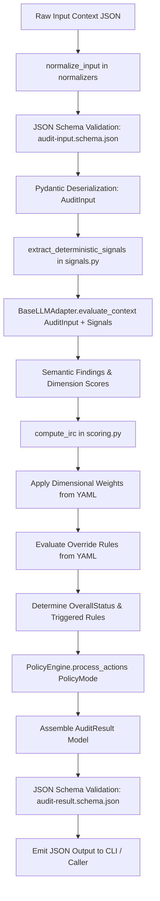

<!-- ============================================================================== -->
<!-- THINKINGSEED: ADN DEL PROYECTO (CONTEXTO PASIVO PARA MODELOS DE LENGUAJE)     -->
<!-- ============================================================================== -->
> [!NOTE]
> ### 🧬 DEFINICIÓN Y ROL DE ESTE DOCUMENTO
> 1. **¿Qué es este archivo?:** Este documento es una **Semilla de Proyecto (ThinkingSeed Master)**: representa el **ADN arquitectónico, técnico y estructural exhaustivo** del sistema. **NO es el repositorio completo de código fuente**, sino su mapa genético y memoria técnica profunda extraída directamente del entorno de desarrollo.
> 2. **Estado de Avance (Work in Progress):** Este documento refleja el **estado actual del desarrollo**. No garantiza que el proyecto esté concluido al 100%; puede representar un prototipo, un MVP o un sistema en evolución continua. La ausencia de código completo en ciertos archivos o módulos es **deliberada por diseño** para optimizar ventana de contexto o refleja áreas aún en desarrollo.
> 3. **Modo de Operación:** Trata este documento como **contexto pasivo de referencia técnica (Ground Truth)**. No asumas que el archivo está defectuoso ni intentes reescribirlo por tu cuenta.
<!-- ============================================================================== -->

# THINKING SEED MASTER: Context Entropy Auditor (CEA)

## 0. IDENTIDAD Y METADATOS
```yaml
seed_schema_version: "2.0"
project_name: "Context Entropy Auditor (CEA)"
repository_name: "ContextEntropy-Auditor"
project_type: "library"
repository_mode: "single-project"
generated_at: "2026-09-16T02:27:08-03:00"
generated_by: "Antigravity (Advanced Agentic Assistant) / Gemini 3.8 Flash (High)"
repository_root: "d:/0001 HyperScale Thinking/PROYECTOS CLOUD/Research and Development/Context Entropy Auditor (CEA)"
git_branch: "master"
git_commit: "db159d33e62d70d4b886377415de25fcf8a2abc3"
working_tree_state: "clean"
analysis_mode: "static"
coverage_level: "high"
known_analysis_limits:
  - "Inspección estática profunda de código fuente Python, esquemas JSON Draft-07, configuración YAML y documentación metodológica."
  - "Suite completa de 25 pruebas unitarias y E2E validada al 100% mediante pytest 9.1.1 en runtime Python 3.12.10."
  - "El adaptador GeminiAdapter se encuentra actualmente en modo Mock funcional para pruebas locales y CLI; la llamada real vía google-genai SDK requiere provisión de GEMINI_API_KEY y conexión online."
  - "El entorno virtual local (.venv) no tiene instalados los paquetes dev (pytest se ejecuta mediante el intérprete del sistema)."
```

### 0.1 Instrucciones para el modelo receptor
1. **ADN vs Repositorio:** Reconoce este documento como la memoria técnica y el ADN del proyecto, no como el repositorio completo ni como una prueba de ejecución.
2. **Contexto Pasivo:** No generes código no solicitado ni reclames por archivos ausentes; espera instrucciones específicas del usuario o utilízalo como contexto pasivo para responder preguntas sobre el funcionamiento del sistema.
3. **Estado de Avance:** Considera que las secciones incompletas o componentes marcados como `[FALTANTE]` representan el avance real del proyecto y oportunidades de asistencia, no errores del documento.
4. **Evidencia:** Respeta las etiquetas de evidencia (`[CONFIRMADO]`, `[INFERIDO]`, `[DECLARADO]`, `[NO VERIFICADO]`, `[FALTANTE]`) y no transformes inferencias en hechos.
5. **Rutas:** Antes de proponer cambios, identifica módulos y archivos afectados citando sus rutas exactas relativas al repositorio.
6. **Contratos:** Conserva arquitectura, convenciones, contratos y restricciones declaradas.
7. **Preguntas Dirigidas:** No inventes componentes ausentes. Formula preguntas solo cuando la incertidumbre impida una respuesta segura.
8. **Seguridad:** No reveles ni solicites secretos. Usa placeholders (`<REDACTED>`).
9. **Impacto:** Evalúa impactos laterales en pruebas, configuración, datos, seguridad, observabilidad y despliegue.
10. **Asistencia:** Distingue entre solución inmediata, deuda técnica y recomendación futura.

---

## 1. RESUMEN EJECUTIVO
- **1.1 Proyecto en una frase:** `[CONFIRMADO]` Context Entropy Auditor (CEA) es un framework y motor de auditoría epistemológica de confiabilidad y entropía contextual para aplicaciones basadas en Modelos de Lenguaje (LLMs), agentes conversacionales y arquitecturas RAG (Capa L5 de observabilidad de inferencia).
- **1.2 Problema que resuelve:** `[CONFIRMADO]` Mitiga y diagnostica fallos críticos de ciclo de vida de contexto que degradan la inferencia del modelo: conflicto de instrucciones, ambigüedad en la tarea, contaminación contextual por persistencia indebida de subtareas anteriores, degradación de evidencia documental, pérdida de integridad del estado agéntico/herramientas y presión por redundancia/ruido en la ventana de contexto.
- **1.3 Usuarios o sistemas consumidores:** `[CONFIRMADO]` Ingenieros de confiabilidad de IA (LLM SREs / Reliability Engineers), orquestadores de agentes autónomos (LangGraph, CrewAI, AutoGen), pipelines de RAG y gateways de inferencia para validación previa o posterior a la ejecución de prompts.
- **1.4 Alcance y límites del sistema:** `[CONFIRMADO]` 
  - **En alcance (MVP v0.5-public):** Extracción de señales deterministas libres de sesgo (zero-LLM), cálculo calibrado de IRC (Índice de Riesgo Contextual / CRS), validación estricta de esquemas JSON Draft-07, motor de políticas de remediación (`PolicyEngine`) y CLI ejecutable (`context-auditor`).
  - **Límites epistemológicos:** `[CONFIRMADO]` CEA prohíbe taxativamente la confabulación mecanicista; no pretende acceder a pesos internos, logits, residual streams ni estados de KV-Cache físicos del LLM, evaluando exclusivamente evidencia textual observable y métricas de runtime medibles. El término "entropía" es una metáfora operativa de degradación y desorden, no una medida de Shannon ni termodinámica.
  - **Fuera de alcance cercano:** `[DECLARADO]` Modos `auto_recover` no supervisados (deshabilitados por diseño), gobernanza multi-tenant enterprise, compresión adaptativa en tiempo real y UI/Dashboard web.

---

## 2. ARQUITECTURA Y TOPOLOGÍA
- **2.1 Estilo arquitectónico:** `[CONFIRMADO]` Arquitectura modular orientada a tuberías de auditoría (Pipeline-based Modular Engine) con desacoplamiento estricto en 6 capas:
  1. *Capa de Ingesta y Normalización* (`normalizers`, `validators`).
  2. *Capa de Señales Deterministas* (`signals` - Zero-LLM).
  3. *Capa de Adaptación Semántica* (`adapters` - LLM Evaluation Harness).
  4. *Capa de Ponderación y Reglas de Anulación* (`scoring` - cálculo IRC).
  5. *Capa de Gobierno y Políticas* (`policies` - PolicyEngine).
  6. *Capa de Interfaces de Consumo* (`cli`, Python SDK).

- **2.2 Árbol estructural del repositorio (excluyendo ruido):** `[CONFIRMADO]`
```
Context Entropy Auditor (CEA)/
├── .gitignore
├── CONTRIBUTING.md                  # Guía para colaboradores
├── Context Entropy Auditor.md       # Prompt inyectable original / Especificación base (v0)
├── Entropy.jpeg                     # Diagrama conceptual de degradación contextual
├── LICENSE                          # Licencia de código abierto MIT
├── ROADMAP.md                       # Plan de releases y directrices de alcance
├── pyproject.toml                   # Manifiesto de empaquetado Python y dependencias
├── 001_Seed/                        # Repositorio de semillas arquitectónicas (ThinkingSeed)
│   └── seed-context-entropy-auditor-master.md
├── 01_Status/                       # Directorio de control de estado (stub)
├── artifacts/                       # Documentación y planes de evolución técnica
│   ├── Fases/
│   │   ├── README.md                # Resumen de estado de los incrementos
│   │   ├── Inc0_Fundacion_Epistemica/ENTREGABLES.md
│   │   ├── Inc1_Prompt_Core/ENTREGABLES.md
│   │   ├── Inc2_Esquemas_Modelos/ENTREGABLES.md
│   │   ├── Inc3_Scoring_Engine/ENTREGABLES.md
│   │   ├── Inc4_Senales_Deterministas/ENTREGABLES.md
│   │   ├── Inc5_SDK_CLI/ENTREGABLES.md
│   │   ├── Inc6_Dataset_Evaluacion/ENTREGABLES.md
│   │   └── Inc7_Publicacion/ENTREGABLES.md
│   ├── plans/
│   │   ├── active/
│   │   │   └── 01 PLAN GPT 5.6 SOL THINKING/
│   │   │       ├── implementation_plan.md
│   │   │       └── INSTRUCCION_MAESTRA_CONTEXT_ENTROPY_AUDITOR.md
│   │   └── archive/
│   │       └── Analisis de Planes/
│   │           ├── Analisis_y_Plan_Definitivo.md
│   │           ├── Plan_Optimizacion_GitHub.md
│   │           └── Plan_Utilidades_Avanzadas.md
│   └── Task del agente/task.md
├── config/
│   └── scoring_defaults.yaml        # Ponderaciones provisionales, umbrales y override rules
├── data/                            # Directorio de datos (processed, raw, sandbox)
│   ├── processed/
│   ├── raw/
│   └── sandbox/
├── dataset/
│   ├── eval_dataset.jsonl           # Dataset de evaluación con casos etiquetados (5 casos iniciales)
│   └── self_audit.json              # Muestra de auto-auditoría sobre el propio contexto
├── docs/
│   ├── methodology.md               # Metodología y principios epistemológicos
│   ├── scoring.md                   # Modelo matemático y rúbricas del IRC (CRS)
│   └── terminology.md               # Taxonomía y glosario bilingüe de fallos
├── Engine/
│   └── EngineReadme.md              # Documentación de motor y orquestación
├── examples/                        # Casos de prueba de contexto estructurado
│   ├── ambiguous-task.json
│   ├── contaminated-context.json
│   ├── healthy-conversation.json
│   ├── instruction-conflict.json
│   └── tool-state-drift.json
├── infrastructure/                  # Directorio de infraestructura (stub)
├── logs/                            # Directorio de logs de ejecución (stub)
├── Notebooks/                       # Directorio de Jupyter Notebooks de análisis (stub)
├── prompts/                         # Plantillas de prompt para auditoría semántica
│   ├── auditor-simple-en.md
│   ├── auditor-simple-es.md
│   ├── auditor-technical-en.md
│   ├── auditor-technical-es.md
│   └── v0-original.md
├── schemas/                         # Contratos formales JSON Schema (Draft-07)
│   ├── audit-input.schema.json
│   └── audit-result.schema.json
├── scripts/
│   ├── Context Entropy Auditor.md
│   └── evaluate.py                  # Script de evaluación de datasets de auditoría
├── src/
│   └── context_auditor/
│       ├── __init__.py              # Exportaciones públicas y versión del paquete
│       ├── auditor.py               # Orquestador principal ContextAuditor
│       ├── cli.py                   # Interfaz de línea de comandos (context-auditor)
│       ├── models.py                # Modelos Pydantic v2 (AuditInput, AuditResult, etc.)
│       ├── policies.py              # Motor de políticas y gobierno de acciones (PolicyEngine)
│       ├── scoring.py               # Algoritmo de cálculo de IRC y reglas de anulación
│       ├── signals.py               # Extractor de señales heurísticas deterministas (zero-LLM)
│       ├── validators.py            # Validadores de conformidad con esquemas JSON Draft-07
│       ├── adapters/
│       │   ├── base.py              # Interfaz abstracta BaseLLMAdapter
│       │   └── gemini.py            # Adaptador para Google Gemini API (Mock / Real)
│       └── normalizers/
│           └── __init__.py          # Normalizador y convertidor de entradas heterogéneas
├── tests/
│   ├── e2e/
│   │   └── test_cli.py              # Pruebas End-to-End del CLI con subprocesos
│   └── unit/
│       ├── test_normalizers.py      # Pruebas unitarias de normalización Pydantic
│       ├── test_policies.py         # Pruebas de modos de política y contención destructiva
│       ├── test_scoring.py          # Pruebas de pesos, umbrales y reglas override
│       ├── test_signals.py          # Pruebas de cálculo de señales deterministas
│       └── test_validators.py       # Pruebas de validación JSON Schema Draft-07
└── Tools/                           # Directorio de herramientas y scripts auxiliares (stub)
```

- **2.3 Responsabilidad por directorio y archivo clave:** `[CONFIRMADO]`
  - `src/context_auditor/auditor.py`: Clase `ContextAuditor`, orquesta el flujo de auditoría E2E: normaliza -> extrae señales deterministas -> invoca adaptador LLM -> calcula IRC y aplica reglas de anulación -> filtra acciones según políticas -> valida schema final.
  - `src/context_auditor/models.py`: Entidades Pydantic v2 (`Role`, `Message`, `Document`, `ToolEvent`, `AuditInput`, `OverallStatus`, `EpistemicStatus`, `AuditScope`, `DimensionScores`, `Finding`, `RecommendedAction`, `AuditResult`).
  - `src/context_auditor/scoring.py`: Funciones `load_scoring_config()`, `compute_base_status()`, `compute_irc()`. Aplica ponderaciones y reglas de anulación cargadas dinámicamente desde `config/scoring_defaults.yaml`.
  - `src/context_auditor/signals.py`: `extract_deterministic_signals()` y `estimate_tokens()`. Calcula tokens estimados (heurística char//4), tasa de utilización contextual (`context_utilization_ratio`), conteo de turnos usuario/asistente, duplicados exactos en documentos (`exact_document_duplicates`), colisión de identificadores (`duplicate_ids_found`), llamadas a herramientas superadas (`superseded_tool_results`) y distancia al último turno de usuario (`messages_since_last_user_turn`).
  - `src/context_auditor/policies.py`: Clase `PolicyEngine` con modos `AUDIT_ONLY`, `RECOMMEND`, `HUMAN_REVIEW`, `DRY_RUN`. Suprime acciones o exige aprobación forzosa (`requires_policy_approval = True`) si una acción es destructiva.
  - `src/context_auditor/validators.py`: Funciones `validate_input()` y `validate_result()`. Utiliza la librería `jsonschema` contra `schemas/audit-input.schema.json` y `schemas/audit-result.schema.json`.
  - `src/context_auditor/adapters/base.py`: Clase abstracta `BaseLLMAdapter` con método abstracto `evaluate_context()`.
  - `src/context_auditor/adapters/gemini.py`: Implementación para Gemini; incluye fallback `_get_mock_evaluation()` para operación sin clave API y stub de integración con el SDK `google-genai`.
  - `src/context_auditor/normalizers/__init__.py`: `normalize_input()`, valida sintácticamente con JSON Schema y des-serializa hacia el modelo fuertemente tipado `AuditInput`.
  - `src/context_auditor/cli.py`: Función `main()`, entrypoint de consola registrado en `pyproject.toml` como `context-auditor`.
  - `config/scoring_defaults.yaml`: Configuración declarativa de pesos dimensionales, rangos de semáforo y reglas de override.
  - `schemas/`: Contratos formales canónicos de entrada y salida bajo estándar JSON Schema Draft-07.
  - `docs/`: Documentación fundamental del marco metodológico (`methodology.md`), modelo matemático de scoring (`scoring.md`) y taxonomía bilingüe (`terminology.md`).
  - `tests/`: Suite completa con 25 pruebas unitarias y E2E que validan todo el pipeline.

- **2.4 Límites modulares y acoplamiento:** `[CONFIRMADO]`
  - **Aislamiento de Señales:** La capa de señales deterministas (`signals.py`) no tiene dependencias de red, de proveedores de IA ni de LLMs; opera exclusivamente sobre datos en memoria.
  - **Motor de Scoring Aislado:** `scoring.py` es puramente algorítmico y declarativo, gobernado por `config/scoring_defaults.yaml`, sin dependencias con proveedores de modelos.
  - **Inversión de Dependencias en LLMs:** Los proveedores de lenguaje se desacoplan mediante la interfaz abstracta `BaseLLMAdapter`, permitiendo intercambiar Gemini por Anthropic, OpenAI o modelos locales sin modificar el core del auditor.
  - **Validación Bidireccional de Contratos:** Toda entrada y salida atraviesa validación JSON Schema estricta antes de ingresar o salir del núcleo del auditor.

---

## 3. FLUJOS DE EJECUCIÓN Y ENTRY POINTS
- **3.1 Puntos de entrada principales:** `[CONFIRMADO]`
  1. **CLI (Línea de comandos):** `context-auditor <input_file.json> [--policy <mode>] [--factual]` vía `src/context_auditor/cli.py` (registrado en `pyproject.toml` como `project.scripts`).
  2. **Python SDK:** `from src.context_auditor import ContextAuditor, GeminiAdapter, PolicyMode; auditor = ContextAuditor(GeminiAdapter()); result = auditor.audit(raw_dict)`.
  3. **Evaluador de Datasets (Benchmark CLI):** `python scripts/evaluate.py` para procesar en lote casos de evaluación contra `dataset/eval_dataset.jsonl`.

- **3.2 Diagrama de flujo principal E2E (Mermaid):** `[CONFIRMADO]`


- **3.3 Ciclo de vida de la ejecución y estados:** `[CONFIRMADO]`
  - **Estado 0 (Ingesta):** Recepción de diccionario de contexto con mensajes, documentos, eventos de herramientas y telemetría de runtime.
  - **Estado 1 (Validación Sintáctica):** Comprobación de conformidad con `audit-input.schema.json` y mapeo a `AuditInput`.
  - **Estado 2 (Extracción Determinista):** Computación de métricas de tokens, ratios de uso de ventana, colisiones de IDs, duplicados de documentos y recencia de turnos sin LLM.
  - **Estado 3 (Evaluación Semántica):** Inferencia evaluativa acotada a las 6 dimensiones estandarizadas (`0`, `25`, `50`, `75`, `100`), emitiendo hallazgos con referencias a evidencia (`evidence_refs`).
  - **Estado 4 (Scoring y Arbitraje):** Cálculo ponderado de IRC y aplicación de reglas de anulación (`override_rules`).
  - **Estado 5 (Filtrado de Políticas):** Interceptación de acciones recomendadas; si una acción es destructiva o el modo es `HUMAN_REVIEW`, se fuerza `requires_policy_approval = True`.
  - **Estado 6 (Conformancia y Emisión):** Validación del dictamen final contra `audit-result.schema.json` y serialización.

---

## 4. MODELO DE DATOS, CONTRATOS Y PERSISTENCIA
- **4.1 Esquemas y entidades principales:** `[CONFIRMADO]`

### Input Model (`AuditInput`)
```json
{
  "schema_version": "1.0.0",
  "messages": [
    {
      "id": "m1",
      "role": "system | user | assistant | tool",
      "content": "string",
      "timestamp": "2026-09-14T20:00:00Z"
    }
  ],
  "documents": [
    {
      "id": "d1",
      "content": "string",
      "source": "string",
      "confidence": 0.95
    }
  ],
  "tool_events": [
    {
      "id": "t1",
      "tool_name": "string",
      "parameters": {},
      "result": "string",
      "timestamp": "2026-09-14T20:00:00Z"
    }
  ],
  "runtime_telemetry": {},
  "audit_configuration": {
    "context_limit_tokens": 128000
  }
}
```

### Output Model (`AuditResult`)
```json
{
  "schema_version": "1.0.0",
  "audit_version": "0.1.0",
  "audit_id": "audit-a1b2c3d4",
  "overall_status": "stable | moderate | high | critical",
  "risk_score": 18.5,
  "confidence": 0.95,
  "evidence_coverage": 1.0,
  "scope": {
    "messages_observed": 4,
    "documents_observed": 1,
    "tool_outputs_observed": 1
  },
  "dimension_scores": {
    "instruction_conflict": 0,
    "task_ambiguity": 0,
    "context_contamination": 0,
    "evidence_quality": 0,
    "state_integrity": 0,
    "redundancy_pressure": 0
  },
  "findings": [
    {
      "finding_id": "f-01",
      "dimension": "instruction_conflict",
      "epistemic_status": "observed | inferred | runtime_measured | unknown",
      "severity": 0,
      "evidence_refs": ["m1"],
      "explanation": "No conflicting instructions detected.",
      "confidence": 0.95
    }
  ],
  "recommended_actions": [
    {
      "action": "continue",
      "target_refs": [],
      "reason": "Context state is healthy.",
      "requires_policy_approval": false,
      "destructive": false
    }
  ],
  "triggered_rules": [],
  "limitations": []
}
```

- **4.2 Almacenamiento, motores de base de datos y migraciones:** `[CONFIRMADO]` Stateless. No requiere base de datos relacional ni motor de almacenamiento persistente. Los datasets de prueba y benchmark residen como archivos `.json` y `.jsonl` en `dataset/` y `examples/`.
- **4.3 Interfaces externas, payloads y contratos de API:** `[CONFIRMADO]` Contratos formales versionados bajo estándar JSON Schema Draft-07 en `schemas/audit-input.schema.json` y `schemas/audit-result.schema.json`.

---

## 5. CONFIGURACIÓN Y AMBIENTE
- **5.1 Tabla de variables de entorno:** `[CONFIRMADO]`

| Variable | Tipo | Default | Efecto | Sensible |
|---|---|---|---|---|
| `GEMINI_API_KEY` | String | `None` | Clave de acceso a la API de Google Gemini en `GeminiAdapter`. Si está ausente, el adaptador conmuta a modo Mock funcional. | Sí (`<REDACTED>`) |
| `CEA_CONFIG_PATH` | String | `config/scoring_defaults.yaml` | Ruta alternativa para la carga de ponderaciones dimensionales y umbrales. | No |

- **5.2 Perfiles de ejecución y modos de política:** `[CONFIRMADO]`
  - `audit_only`: Diagnostica y reporta hallazgos; suprime cualquier acción recomendada (`recommended_actions = []`).
  - `recommend`: Entrega diagnósticos y propone acciones, marcando automáticamente como `requires_policy_approval = true` a toda acción con `destructive: true`.
  - `human_review`: Marca **todas** las acciones recomendadas sin excepción como `requires_policy_approval = true`.
  - `dry_run`: Simula la evaluación y loguea la auditoría para pruebas en pipelines.

- **5.3 Prerrequisitos de sistema e infraestructura:** `[CONFIRMADO]`
  - Python >= 3.9 (validado en runtime Python 3.12.10).
  - Dependencias de producción: `pydantic>=2.0.0`, `jsonschema>=4.0.0`, `pyyaml>=6.0`.
  - Dependencias de desarrollo: `pytest>=7.0.0` (validado con pytest 9.1.1).

---

## 6. PRUEBAS, CI/CD Y OPERACIÓN
- **6.1 Estrategia de pruebas:** `[CONFIRMADO]`
  - **Pruebas Unitarias (`tests/unit/` - 23 tests):**
    - `test_normalizers.py` (2 tests): Valida parsing de diccionarios crudos a modelos Pydantic y rechazo con error de payloads malformados.
    - `test_policies.py` (3 tests): Valida supresión de acciones en modo `AUDIT_ONLY`, aprobación forzosa en `HUMAN_REVIEW` y contención de acciones destructivas en modo `RECOMMEND`.
    - `test_scoring.py` (5 tests): Valida la fórmula matemática de ponderación del IRC, asignación de semáforos y activación de reglas de anulación (`critical_conflict`, `critical_state`, `low_coverage`).
    - `test_signals.py` (7 tests): Valida conteo exacto de mensajes, estimación de tokens, duplicados de documentos, colisiones de IDs, reemplazo de herramientas y cálculo de turnos.
    - `test_validators.py` (6 tests): Valida conformidad estricta contra `schemas/audit-input.schema.json` y `schemas/audit-result.schema.json`.
  - **Pruebas End-to-End (`tests/e2e/` - 2 tests):**
    - `test_cli.py` (2 tests): Ejecuta subprocesos invocando `cli.py` sobre `examples/healthy-conversation.json` verificando salida en JSON estándar y retorno exitoso (exit code 0).
  - **Tasa de Éxito Actual:** 25/25 tests ejecutados y aprobados al 100% en 4.81s (`pytest-9.1.1`).
- **6.2 Automatización y pipelines CI/CD:** `[DECLARADO]` Previsto en fase `v0.7` según `ROADMAP.md`; `.github/workflows/` no está creado aún (`[FALTANTE]`).
- **6.3 Contenedores y orquestación:** `[INFERIDO]` No contiene Dockerfile actualmente; se distribuye y ejecuta como módulo Python estándar instalable vía `pip install -e .`.

---

## 7. OBSERVABILIDAD Y MODOS DE FALLA
- **7.1 Logs, métricas y tracing:** `[CONFIRMADO]`
  - **Tripleta de Auditoría:** Toda evaluación emite obligatoriamente `risk_score` (0.0-100.0), `confidence` (0.0-1.0) y `evidence_coverage` (0.0-1.0).
  - **Telemetría de Alcance (Scope):** Recuento explícito de `messages_observed`, `documents_observed`, `tool_outputs_observed` y `context_utilization_ratio`.
- **7.2 Modos de falla conocidos y estrategias de recuperación:** `[CONFIRMADO]`
  - *Falla por Payload Malformado:* Atrapado tempranamente por `jsonschema.validate` arrojando `ValidationError` antes de alcanzar el adaptador LLM o el motor de scoring.
  - *Falla por Falta de Cobertura (`evidence_coverage < 0.30`):* Dispara la regla `low_coverage_prevented_stable`, impidiendo que un contexto truncado o ciego sea calificado como `stable` y forzando el estado a `moderate`.
  - *Falla de Conflicto Crítico de Instrucción (`instruction_conflict == 100`):* Dispara la regla `critical_conflict_high_risk`, forzando el estado mínimo a `high`.
  - *Falla de Integridad Crítica de Estado (`state_integrity == 100`):* Dispara la regla `critical_state_high_risk`, forzando el estado mínimo a `high`.
  - *Falla de Calidad de Evidencia en Tareas Factuales (`evidence_quality == 100` y `--factual`):* Dispara la regla `critical_evidence_critical_risk`, forzando el estado a `critical`.
- **7.3 Idempotencia y reintentos:** `[CONFIRMADO]` Las etapas deterministas (normalización, extracción de señales, scoring y filtrado de políticas) son 100% deterministas e idempotentes para un payload dado.

---

## 8. SEGURIDAD Y PRIVACIDAD
- **8.1 Hallazgos de seguridad estática:** `[CONFIRMADO]`
  - El contenido auditado se procesa como **datos no confiables (untrusted data)**; los validadores impiden inyecciones estructurales mediante validación tipada estricta Pydantic y JSON Schema Draft-07.
  - El CLI y la librería nunca ejecutan código dinámico (`eval`, `exec`).
- **8.2 Manejo de autenticación, autorización y secretos:** `[CONFIRMADO]`
  - Las claves de API se leen de variables de entorno (`os.environ.get("GEMINI_API_KEY")`) y no se persisten en código ni en artefactos.
  - Los reportes de auditoría utilizan referencias por ID (`target_refs`, `evidence_refs`) en lugar de volcar secretos de autenticación.
  - Toda acción clasificada como destructiva (`destructive: true`) exige autorización forzosa en la capa de políticas (`requires_policy_approval: true`).
- **8.3 Privacidad de datos y cumplimiento:** `[CONFIRMADO]`
  - Arquitectura stateless: no retiene memoria ni persiste los mensajes de los usuarios fuera del ciclo de vida de la llamada a la función de auditoría.

---

## 9. ESTADO REAL, DEUDA TÉCNICA Y LIMITACIONES
- **9.1 Nivel de madurez y avance real del proyecto:** `[CONFIRMADO]`
  - **Fase actual:** `v0.5-public` (MVP funcional de alta calidad arquitectónica).
  - **Componentes completados:** Modelos Pydantic v2, esquemas JSON Draft-07, motor de scoring con configuración YAML desacoplada, extractor de señales deterministas (zero-LLM), motor de políticas de remediación y CLI ejecutable con 25 pruebas pasando al 100%.
- **9.2 Deuda técnica identificada y stubs pendientes:** `[CONFIRMADO]`
  1. `GeminiAdapter` (`src/context_auditor/adapters/gemini.py`): Implementa fallback `_get_mock_evaluation` y mantiene stub `raise NotImplementedError` para llamadas reales a la API de Google Gemini mediante el SDK `google-genai`.
  2. Dataset de evaluación y calibración: actualmente `dataset/eval_dataset.jsonl` contiene 5 casos etiquetados; el roadmap para v0.6 exige escalar a 30-50 casos con métricas formales de precisión y recall.
  3. Suite de tests adversariales (`tests/adversarial/`): proyectada pero pendiente de implementación (`[FALTANTE]`).
  4. Entorno virtual local (`.venv`): no tiene instalados los paquetes dev (la ejecución de tests requirió el intérprete global de Python 3.12 con pytest 9.1.1).
- **9.3 Inconsistencias entre código y documentación:** `[CONFIRMADO]`
  1. `__version__ = "0.1.0"` en `src/context_auditor/__init__.py` versus `version = "0.5.0"` en `pyproject.toml`.
  2. `Artefactos/Fases/README.md` marca los incrementos 6 y 7 como "Completado", mientras que `Artefactos/Fases/Inc6_Dataset_Evaluacion/ENTREGABLES.md` y `Inc7_Publicacion/ENTREGABLES.md` indican entregables pendientes (⏳).
  3. `LICENSE` en la raíz es de tipo MIT, mientras que `Inc7_Publicacion/ENTREGABLES.md` mencionaba inicialmente "Licencia Apache 2.0".
  4. El archivo raíz `Context Entropy Auditor.md` contiene la versión preliminar del prompt v0 con términos antiguos (`Trajectory Lock-in`, `Lost-in-the-Middle`), los cuales fueron formalmente reemplazados en `docs/scoring.md` y en `src/context_auditor/models.py`.

---

## 10. REGLAS PARA MODIFICAR EL PROYECTO
- **10.1 Convenciones de estilo, linting y tipado:** `[CONFIRMADO]`
  - Tipado estricto con anotaciones de tipo estándar Python (`typing.List`, `Dict`, `Optional`, `Tuple`) y Pydantic v2.
  - Convención snake_case para funciones y variables; PascalCase para clases y modelos.
  - Esquemas JSON en formato kebab-case (`audit-input.schema.json`, `audit-result.schema.json`).
  - Documentación bilingüe (código y nombres de variables en inglés; explicaciones metodológicas en inglés y español).
- **10.2 Reglas arquitectónicas inviolables:** `[CONFIRMADO]`
  1. **Rigor Epistemológico:** Prohibido emitir diagnósticos mecanicistas basados en suposiciones no observables en texto o telemetría (prohibido afirmar acceso a pesos internos, logits o estado físico de KV-Cache).
  2. **Tripleta Obligatoria:** Ningún resultado de auditoría puede carecer de `risk_score`, `confidence` o `evidence_coverage`.
  3. **No Destrucción sin Aprobación:** Toda acción destructiva (`destructive: true`) debe exigir aprobación de políticas (`requires_policy_approval: true`).
  4. **Configuración Externa:** Los pesos de las dimensiones y las reglas de override jamás deben estar hardcodeados en código fuente Python; deben residir en `config/scoring_defaults.yaml`.
  5. **Conformidad de Esquemas:** Todo cambio en `src/context_auditor/models.py` debe reflejarse y validarse contra los esquemas canónicos en `schemas/`.
- **10.3 Checklist de verificación previa a commit:** `[CONFIRMADO]`
  - [ ] Ejecutar la suite de pruebas completa: `python -m pytest` y verificar que los 25 tests pasen al 100%.
  - [ ] Comprobar que los modelos Pydantic en `models.py` sincronicen exactamente con `schemas/audit-input.schema.json` y `schemas/audit-result.schema.json`.
  - [ ] Validar compatibilidad de `config/scoring_defaults.yaml` con `scoring.py`.
  - [ ] Verificar que no existan secretos, tokens o credenciales expuestas en ejemplos, datasets o código fuente.

---

## 📌 CONTEXT HANDOFF & PROTOCOLO DE ASISTENCIA

> **Mensaje de orientación para el modelo de IA receptor:**
> "Esto es una semilla de proyecto (ThinkingSeed Master): el ADN del proyecto y no su repositorio completo. Refleja el avance real y la arquitectura del sistema hasta la fecha. Como modelo receptor, tu función es usar esta semilla como memoria técnica para:
> 1. **Responder preguntas** sobre la arquitectura, funcionamiento, dependencias y flujos del sistema.
> 2. **Sugerir mejoras o asistencia técnica** sobre el estado actual y áreas pendientes identificadas en la semilla.
> 3. **Generar código o soluciones compatibles** respetando las rutas, convenciones y patrones definidos aquí, cuando el usuario te lo solicite."

### Pautas de resolución:
Antes de resolver una solicitud:
1. Identifica el objetivo del usuario.
2. Localiza los componentes afectados usando las rutas del Seed.
3. Revisa restricciones, reglas y contratos declarados.
4. Explicita supuestos cuando sea necesario: "Supongo que X debido a Y".
5. Propone cambios por archivo con rutas claras.
6. Añade pruebas, riesgos y criterios de aceptación.

### 🤝 Acuse de Recibo Inicial
Si el usuario adjuntó esta semilla **sin una instrucción específica**, no intentes generar código ni completar archivos vacíos. Responde únicamente con:
1. Un saludo confirmando que asimilaste el ADN de **Context Entropy Auditor (CEA)** y su stack principal.
2. Un breve resumen de 2-3 líneas sobre el objetivo y su estado actual de avance.
3. Una frase poniéndote a disposición para resolver dudas sobre su funcionamiento o colaborar en los siguientes pasos de desarrollo.
