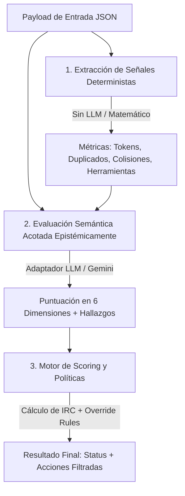

# Auditor de Entropía de Contexto — Context Entropy Auditor (CEA)

[](LICENSE)
[](pyproject.toml)
[](README_ES.md)
[](README.md)

> **Framework de confiabilidad de contexto basado en evidencia determinista y semántica para aplicaciones con Grandes Modelos de Lenguaje (LLMs).**

---

## Resumen Ejecutivo (Abstract)

A medida que los Grandes Modelos de Lenguaje (LLMs) procesan ventanas de contexto cada vez más extensas y complejas, la probabilidad de degradación epistémica (conflictos entre instrucciones, deriva de estado en herramientas y contaminación de contexto) se incrementa de forma exponencial. El **Context Entropy Auditor (CEA)** es un framework determinista y semántico diseñado para medir, evaluar y mitigar la degradación del contexto en aplicaciones impulsadas por LLMs.

Al imponer límites epistémicos estrictos (datos *observados* vs. *inferidos*) e aislar las señales matemáticas deterministas de la evaluación semántica, CEA proporciona un **Índice de Riesgo y Contaminación (IRC)** cuantificable que determina si el contexto de un agente es lo suficientemente estable como para proceder con una tarea determinada.

---

## 1. Introducción

Las aplicaciones modernas basadas en LLMs, especialmente los agentes autónomos, operan a lo largo de sesiones prolongadas. A medida que la sesión avanza, la ventana de contexto acumula instrucciones de sistema (*system prompts*), directivas del usuario, documentos recuperados vía RAG y resultados de herramientas (*tools*).

Esta acumulación conduce inevitablemente a la **"Entropía de Contexto"** (*Context Entropy*): un estado donde instrucciones contradictorias, datos obsoletos de herramientas y ruido irrelevante comprometen la capacidad del modelo para actuar de manera determinista y segura.

El Context Entropy Auditor actúa como un observador estricto e independiente (*out-of-band*). No genera contenido para el usuario final; en su lugar, audita el estado de la conversación y la memoria antes de que se tome una acción crítica, dictaminando si el contexto es seguro, ambiguo o críticamente contaminado.

---

## 2. Vanguardia Arquitectónica

La arquitectura de CEA representa un cambio de paradigma en la evaluación de LLMs, alejándose de calificaciones subjetivas (*"vibes-based"*) hacia una auditoría epistémica rigurosa. El sistema se divide en tres áreas operativas fundamentales:



### 2.1. Extracción de Señales Deterministas (Zero-LLM)
* **Explicación Técnica:** Antes de realizar cualquier evaluación con LLM, CEA extrae verdades matemáticas absolutas del payload de entrada. Esto incluye tasas de duplicación exacta de documentos mediante hashes, ratios de utilización del límite de contexto, integridad de identificadores (IDs) y detección de reemplazo/superposición de estados en herramientas.
* **Lenguaje Sencillo:** Antes de pedirle a una IA que juzgue la situación, el sistema hace matemática pura. Cuenta cuántos mensajes existen, verifica si hay documentos duplicados exactamente y detecta si la IA está ignorando resultados nuevos de herramientas en favor de antiguos. Esto proporciona hechos innegables sobre la salud de la conversación.

### 2.2. Evaluación Semántica Acotada Epistémicamente
* **Explicación Técnica:** CEA utiliza un LLM secundario (ej. Gemini) estrictamente como un clasificador semántico restringido por reglas epistémicas rígidas. El LLM no puede atribuirse conocimiento de los pesos internos ni de los mecanismos de atención del modelo principal. Está obligado a clasificar los hallazgos estrictamente como `observed` (presentes explícitamente en el texto) o `inferred` (deducidos de contradicciones textuales). La evaluación abarca seis dimensiones en una escala discreta (0, 25, 50, 75, 100):
  1. **Instruction Conflict:** Conflicto entre directivas activas simultáneas.
  2. **Task Ambiguity:** Ausencia o ambigüedad del objetivo o criterios de éxito.
  3. **Context Contamination:** Persistencia dañina de reglas o tareas previas.
  4. **Evidence Quality:** Relevancia, consistencia y procedencia de documentos.
  5. **State Integrity:** Coherencia en el uso y resultado de herramientas.
  6. **Redundancy Pressure:** Duplicación y presión por dilución de señal.
* **Lenguaje Sencillo:** Usamos una segunda IA para leer la conversación y buscar conflictos lógicos o instrucciones confusas. Sin embargo, forzamos a esta IA a apegarse estrictamente a los hechos: solo puede reportar lo que está escrito en el texto, evitando que alucine o adivine lo que la IA principal "podría estar pensando".

### 2.3. Motor de Scoring y Políticas (*Policy Engine*)
* **Explicación Técnica:** Un motor de reglas determinista calcula el Índice de Riesgo y Contaminación (IRC). Aplica pesos preconfigurados (`config/scoring_defaults.yaml`) a las dimensiones semánticas y ejecuta políticas de anulación (*override rules*). Por ejemplo, si `state_integrity` alcanza 100 en una tarea factual, el estado se clasifica de inmediato como **Crítico**, independientemente del promedio general. El Motor de Políticas filtra luego las acciones recomendadas, garantizando que acciones destructivas (como borrar memoria) requieran aprobación explícita.
* **Lenguaje Sencillo:** El sistema combina la matemática (Área 1) y la revisión semántica (Área 2) para calcular una puntuación final de riesgo. Si detecta un peligro crítico —como depender de documentos falsos en una tarea factual— dispara la alarma inmediatamente, sin importar qué tan bien se vea el resto de la conversación. También bloquea acciones peligrosas de forma automática.

---

## 3. Instalación y Uso

CEA está construido como un paquete moderno de Python compatible con Python 3.9 o superior.

### Instalación

```bash
# Clonar el repositorio
git clone https://github.com/hyperscale/context-entropy-auditor.git
cd context-entropy-auditor

# Crear entorno virtual e instalar en modo editable
python -m venv .venv
source .venv/bin/activate  # En Windows: .\.venv\Scripts\Activate.ps1
pip install -e .
```

### Interfaz de Línea de Comandos (CLI)

El auditor se puede invocar directamente desde la terminal contra un payload JSON conforme a la especificación `audit-input.schema.json`.

```bash
# Evaluación básica recomendando acciones
context-auditor examples/healthy-conversation.json

# Evaluación requiriendo verificación factual estricta y política de revisión humana
context-auditor examples/contaminated-context.json --factual --policy human_review
```

---

## 4. Glosario Técnico

* **Entropía de Contexto (*Context Entropy*):** Medida del desorden, contradicción y ruido irrelevante dentro de la ventana de contexto de un LLM. Una alta entropía se correlaciona directamente con la pérdida de confiabilidad determinista.
* **Límite Epistémico (*Epistemic Boundary*):** La delimitación estricta entre lo que un auditor puede saber con certeza (presencia textual) y lo que no puede saber (el estado cognitivo o mecánico interno del LLM evaluado).
* **IRC (Índice de Riesgo y Contaminación):** Escalar ponderado (0-100) que representa el peligro general de ejecutar una tarea dado el estado actual del contexto.
* **Instruction Conflict:** Estado donde dos o más directivas dentro del contexto se excluyen mutuamente (ej. un system prompt pidiendo brevedad y un user prompt solicitando un ensayo extenso).
* **Context Contamination:** Persistencia de reglas, restricciones o personajes de tareas anteriores ya resueltas que se filtran e interfieren en la tarea actual.
* **State Integrity:** Coherencia en el uso de herramientas y memoria. Ocurre pérdida de integridad cuando el modelo alucina salidas de herramientas, ignora resultados recientes o confía en datos obsoletos.
* **Redundancy Pressure:** Tensión computacional y de atención causada por información idéntica o altamente similar repetida en el contexto, diluyendo la relevancia de instrucciones nuevas.
* **Policy Engine:** Módulo determinista encargado de interceptar recomendaciones de mitigación y aplicar restricciones de ejecución (ej. exigir revisión humana para operaciones destructivas).

---

## 5. Estructura del Repositorio

```text
├── src/context_auditor/    # Código fuente principal (Auditor, Scoring, Signals, Policies, Adapters)
├── schemas/                # JSON Schemas formales (audit-input, audit-result)
├── config/                 # Configuración de scoring ponderado (scoring_defaults.yaml)
├── prompts/                # Prompts evaluadores técnicos y simples (ES / EN)
├── examples/               # Casos de prueba en JSON (healthy, contaminated, conflict, etc.)
├── dataset/                # Dataset de evaluación etiquetado (eval_dataset.jsonl)
├── tests/                  # Pruebas unitarias (unit/) y end-to-end (e2e/)
└── 001_Seed/               # Snapshot y ADN técnico del proyecto (ThinkingSeed Master)
```

---

## Licencia y Contribución

Este proyecto está bajo la Licencia MIT. Consulta los archivos [`LICENSE`](LICENSE) y [`CONTRIBUTING.md`](CONTRIBUTING.md) para más detalles.
