# METRICSTHINKING™: Auditoría Forense y Madurez del Proyecto

> **Motor Evaluador:** MetricsThinking™ v3.0 Universal  
> **Proyecto Auditado:** `Context Entropy Auditor (CEA)`  
> **Ubicación:** `D:\0001 HyperScale Thinking\PROYECTOS CLOUD\Research and Development\Context Entropy Auditor (CEA)`  
> **Fecha de Auditoría:** `2026-09-28 12:55:46`  
> **Auditor Responsable:** `MetricsThinking™ Universal Auditor`  
> **Perfil Aplicado:** `C:\Users\Alvaro\.gemini\config\skills\metrics\profiles\llmops.yaml` (`llmops`)  
> **Modo de Inspección:** `pipeline_orchestration`  
> **ThinkingSeed:** `Detectado (v3.0)`  
> **Git Commit / Branch:** `ac6e62b` / `master`  
> **Score Consolidado:** **`68.8% / 100.0%`**  
> **Banda de Madurez:** **Construcción Activa / Madurez Media (50.0% - 74.9%)**

---

## 1. RESUMEN EJECUTIVO Y GROUND TRUTH

MetricsThinking™ ha completado la auditoría forense estricta basada en evidencias físicas verificables en el repositorio.

- **Nota Global Consolidada ($Score_{Total}$):** **`68.75%`**
- **Arquetipo de Dominio:** **`llmops`** (Modo: `pipeline_orchestration`)
- **Criterios Cumplidos:** **`23 / 31`** (74.2%)
- **Cuello de Botella Inmediato:** **`M03: Guardrails, Seguridad y Red Teaming (66.7% completado)`**
- **Archivos Físicos Escaneados:** **`99`**
- **Memoria Técnica (Seed):** `Presente`
- **Gobernanza iDirectory (.context.yaml):** `Activa`

### Primitivas Universales de Evidencia

| Primitiva | Archivos Clasificados | Rutas de Muestra |
|:---|:---:|:---|
| **Config** | `26` | `pyproject.toml`, `01_seed/.context.yaml`, `02_foundation/engine/.context.yaml` |
| **Spec** | `3` | `01_seed/seed-context-entropy-auditor-master.md`, `schemas/audit-input.schema.json`, `schemas/audit-result.schema.json` |
| **Pipeline** | `0` | — |
| **Verification** | `9` | `03_research/experiments/.context.yaml`, `tests/e2e/test_cli.py`, `tests/unit/test_antigravity_adapter.py` |
| **Implementation** | `20` | `03_research/prompts/.context.yaml`, `prompts/auditor-simple-en.md`, `prompts/auditor-simple-es.md` |

---

## 2. DASHBOARD EJECUTIVO DE MADUREZ POR MÓDULOS CANÓNICOS

| ID | Nombre del Módulo | Peso ($W_i$) | Criterios Cumplidos | % Cumplimiento | Contribución ($S_i$) | Estado |
|:---|:---|:---:|:---:|:---:|:---:|:---:|
| **M01** | Definición del Problema GenAI y Casos de Uso | **5%** | `3 / 3` | **100.0%** | **5.00%** | 🟢 Done |
| **M02** | Arquitectura de Prompts, Contexto y Vectorstores | **10%** | `4 / 4` | **100.0%** | **10.00%** | 🟢 Done |
| **M03** | Guardrails, Seguridad y Red Teaming | **5%** | `2 / 3` | **66.7%** | **3.33%** | 🔵 Active |
| **M04** | Versionado de Prompts y Configuración de Modelos | **5%** | `3 / 3` | **100.0%** | **5.00%** | 🟢 Done |
| **M05** | Motor de Orquestación Agéntica y RAG Core | **25%** | `3 / 4` | **75.0%** | **18.75%** | 🔵 Active |
| **M06** | Adaptadores de Model Providers y Serialización | **15%** | `2 / 3` | **66.7%** | **10.00%** | 🔵 Active |
| **M07** | Suites de Evaluación GenAI (Evals & Red Teaming) | **10%** | `1 / 3` | **33.3%** | **3.33%** | 🔵 Active |
| **M08** | Cockpits de Observabilidad, Costos y CLI | **10%** | `1 / 3` | **33.3%** | **3.33%** | 🔵 Active |
| **M09** | CI/CD y Puertas de Calidad para Prompts/Modelos | **10%** | `1 / 2` | **50.0%** | **5.00%** | 🔵 Active |
| **M10** | Memoria Técnica, Context Mastery y Roadmap | **5%** | `3 / 3` | **100.0%** | **5.00%** | 🟢 Done |
| **TOTAL** | **Ciclo de Vida Completo (LLMOPS)** | **100%** | `23 / 31` | — | **`68.75%`** | **CONSTRUCTION** |

---

## 3. ROADMAP VISUAL DE MADUREZ (MERMAID LR OPTIMIZADO)

Visualización de alta legibilidad en IDE con flujo horizontal continuo y codificación semántica de colores:

```mermaid
flowchart LR
    M01["<b>M01: Definición del Problema GenAI y Casos de Uso</b><br/>100.0% | Done"]
    M02["<b>M02: Arquitectura de Prompts, Contexto y Vectorstores</b><br/>100.0% | Done"]
    M03["<b>M03: Guardrails, Seguridad y Red Teaming</b><br/>66.7% | Active"]
    M04["<b>M04: Versionado de Prompts y Configuración de Modelos</b><br/>100.0% | Done"]
    M05["<b>M05: Motor de Orquestación Agéntica y RAG Core</b><br/>75.0% | Active"]
    M06["<b>M06: Adaptadores de Model Providers y Serialización</b><br/>66.7% | Active"]
    M07["<b>M07: Suites de Evaluación GenAI (Evals & Red Teaming)</b><br/>33.3% | Active"]
    M08["<b>M08: Cockpits de Observabilidad, Costos y CLI</b><br/>33.3% | Active"]
    M09["<b>M09: CI/CD y Puertas de Calidad para Prompts/Modelos</b><br/>50.0% | Active"]
    M10["<b>M10: Memoria Técnica, Context Mastery y Roadmap</b><br/>100.0% | Done"]

    M01 --> M02
    M02 --> M03
    M03 --> M04
    M04 --> M05
    M05 --> M06
    M06 --> M07
    M07 --> M08
    M08 --> M09
    M09 --> M10

    SUMMARY["<b>RESUMEN EJECUTIVO</b><br/>Score: 68.8% | CONSTRUCTION<br/>Cuello de Botella: M03: Guardrails, Seguridad y Red Teaming"]
    M10 ==> SUMMARY

    %% Estilos semánticos
    classDef done fill:#1E4620,stroke:#2ECC71,stroke-width:2px,color:#FFFFFF;
    classDef active fill:#0D47A1,stroke:#2196F3,stroke-width:3px,color:#FFFFFF;
    classDef backlog fill:#2C3E50,stroke:#7F8C8D,stroke-width:1px,stroke-dasharray: 4 4,color:#BDC3C7;
    classDef blocked fill:#641E16,stroke:#E74C3C,stroke-width:2px,color:#FFFFFF;
    classDef summary fill:#1A252F,stroke:#F39C12,stroke-width:2px,color:#F1C40F;

    class M01 done;
    class M02 done;
    class M03 active;
    class M04 done;
    class M05 active;
    class M06 active;
    class M07 active;
    class M08 active;
    class M09 active;
    class M10 done;
    class SUMMARY summary;
```

**Leyenda Semántica:** `🟢 Verde (#1E4620 / #2ECC71)` = Done (100%) | `🔵 Azul (#0D47A1 / #2196F3)` = Active (1-99%) | `⚪ Gris (#2C3E50 / #7F8C8D)` = Backlog (0%) | `🔴 Rojo (#641E16 / #E74C3C)` = Blocked

---

## 4. DESGLOSE FORENSE DE EVIDENCIAS POR MÓDULO

### M01: Definición del Problema GenAI y Casos de Uso — 🟢 DONE (100.0%)
**Peso Relativo:** 5% | **Contribución Ponderada:** 5.00%

| Criterio | Nombre | Estado | Evidencia Física Detectada |
|:---|:---|:---:|:---|
| `M01-C01` | GenAI Problem Statement & Task Framing | ✅ `[CUMPLIDO]` | **`01_seed/seed-context-entropy-auditor-master.md`** — Problem statement formalizado en '01_seed/seed-context-entropy-auditor-master.md'. |
| `M01-C02` | Límites de Contexto y Scope de Alucinación | ✅ `[CUMPLIDO]` | **`01_seed/seed-context-entropy-auditor-master.md`** — Límites de alcance y fronteras del sistema identificados en '01_seed/seed-context-entropy-auditor-master.md'. |
| `M01-C03` | User Personas y Flujos de Conversación | ✅ `[CUMPLIDO]` | **`01_seed/seed-context-entropy-auditor-master.md`** — Perfiles de uso y casos definidos en '01_seed/seed-context-entropy-auditor-master.md'. |

### M02: Arquitectura de Prompts, Contexto y Vectorstores — 🟢 DONE (100.0%)
**Peso Relativo:** 10% | **Contribución Ponderada:** 10.00%

| Criterio | Nombre | Estado | Evidencia Física Detectada |
|:---|:---|:---:|:---|
| `M02-C01` | Context Engineering & Memory Architecture | ✅ `[CUMPLIDO]` | **`src/context_auditor/auditor.py`** — Arquitectura de Context Engineering / Vectorstores identificada en 'src/context_auditor/auditor.py'. |
| `M02-C02` | ADRs de Selección de Modelos y Providers | ✅ `[CUMPLIDO]` | **`artifacts/plans/active/INFERRED_ROADMAP.md`** — Registro formal de decisiones arquitectónicas (ADRs) documentado en 'artifacts/plans/active/INFERRED_ROADMAP.md'. |
| `M02-C03` | Contratos de Entrada/Salida de Agentes | ✅ `[CUMPLIDO]` | **`schemas/audit-input.schema.json`** — Contratos formales de datos / esquemas presentes (2 esquemas, e.g. 'schemas/audit-input.schema.json'). |
| `M02-C04` | Topología de Flujos Agénticos o RAG | ✅ `[CUMPLIDO]` | **`.context/tree.json`** — Mapa topológico satelital y grafo formal del proyecto activo en '.context/tree.json'. |

### M03: Guardrails, Seguridad y Red Teaming — 🔵 ACTIVE (66.7%)
**Peso Relativo:** 5% | **Contribución Ponderada:** 3.33%

| Criterio | Nombre | Estado | Evidencia Física Detectada |
|:---|:---|:---:|:---|
| `M03-C01` | Filtros de PII y Sanitización de Prompts | ✅ `[CUMPLIDO]` | **`01_seed/seed-context-entropy-auditor-master.md`** — Políticas de privacidad y clasificación PII documentadas en '01_seed/seed-context-entropy-auditor-master.md'. |
| `M03-C02` | Guardrails de Seguridad y Detección de Jailbreaks | ❌ `[FALTANTE]` | No se encontraron guardrails de seguridad ni filtros de moderación para LLMs. |
| `M03-C03` | Validación de Structured Outputs | ✅ `[CUMPLIDO]` | **`.context/tree.json`** — Gobernanza contextual iDirectory activa con 25 archivos de contexto (.context.yaml). |

### M04: Versionado de Prompts y Configuración de Modelos — 🟢 DONE (100.0%)
**Peso Relativo:** 5% | **Contribución Ponderada:** 5.00%

| Criterio | Nombre | Estado | Evidencia Física Detectada |
|:---|:---|:---:|:---|
| `M04-C01` | Prompt Registry Versionado | ✅ `[CUMPLIDO]` | **`03_research/prompts/.context.yaml`** — Catálogo de prompt templates versionado presente en '03_research/prompts/.context.yaml'. |
| `M04-C02` | Configuración de Hiperparámetros de Inferencia | ✅ `[CUMPLIDO]` | **`pyproject.toml`** — Manifiesto de empaquetado y entorno reproducible verificado en 'pyproject.toml'. |
| `M04-C03` | Golden Prompts & Fixtures de Evaluación | ✅ `[CUMPLIDO]` | **`data/processed/.context.yaml`** — Fixtures y datos de prueba disponibles (2 archivos, e.g. 'data/processed/.context.yaml'). |

### M05: Motor de Orquestación Agéntica y RAG Core — 🔵 ACTIVE (75.0%)
**Peso Relativo:** 25% | **Contribución Ponderada:** 18.75%

| Criterio | Nombre | Estado | Evidencia Física Detectada |
|:---|:---|:---:|:---|
| `M05-C01` | Parsers de Ingesta y Fragmentación Documental | ✅ `[CUMPLIDO]` | **`03_research/prompts/.context.yaml`** — Módulos de procesamiento e implementación activos (20 archivos, e.g. '03_research/prompts/.context.yaml'). |
| `M05-C02` | Motor de Reranking y Búsqueda Híbrida | ✅ `[CUMPLIDO]` | **`03_research/prompts/.context.yaml`** — Lógica nuclear de implementación presente en 20 módulos. |
| `M05-C03` | Resolución de Tools y Multi-Agent Orchestration | ✅ `[CUMPLIDO]` | **`src/context_auditor/auditor.py`** — Arquitectura modular interconectada (14 archivos fuente). |
| `M05-C04` | Generador de Respuestas y Síntesis Contextual | ❌ `[FALTANTE]` | No se detectó generador de métricas ni sintetizador canónico. |

### M06: Adaptadores de Model Providers y Serialización — 🔵 ACTIVE (66.7%)
**Peso Relativo:** 15% | **Contribución Ponderada:** 10.00%

| Criterio | Nombre | Estado | Evidencia Física Detectada |
|:---|:---|:---:|:---|
| `M06-C01` | Adaptadores Multiprovider de LLMs | ✅ `[CUMPLIDO]` | **`src/context_auditor/adapters/antigravity.py`** — Emisores y serializadores de destino verificados en 'src/context_auditor/adapters/antigravity.py'. |
| `M06-C02` | Streaming Seguro y Manejo Atómico de Respuestas | ❌ `[FALTANTE]` | Falta estandarización de escritura atómica y safe-encoding UTF-8. |
| `M06-C03` | Serialización Multi-Formato de Telemetría | ✅ `[CUMPLIDO]` | Soporte de representación multi-formato verificado en el repositorio (.jpeg, .json, .jsonl, .md, .ps1). |

### M07: Suites de Evaluación GenAI (Evals & Red Teaming) — 🔵 ACTIVE (33.3%)
**Peso Relativo:** 10% | **Contribución Ponderada:** 3.33%

| Criterio | Nombre | Estado | Evidencia Física Detectada |
|:---|:---|:---:|:---|
| `M07-C01` | Suites de Evaluación Automática (RAGAS / DeepEval) | ✅ `[CUMPLIDO]` | **`dataset/eval_dataset.jsonl`** — Suite de evaluación automática de LLMs verificada en 'dataset/eval_dataset.jsonl'. |
| `M07-C02` | Pruebas de Regresión Contra Golden Evals | ❌ `[FALTANTE]` | No se encontraron pruebas de regresión con archivos Golden/Snapshots. |
| `M07-C03` | Pruebas de Estrés de Concurrencia y Rate Limits | ❌ `[FALTANTE]` | No se detectaron suites de benchmarking ni pruebas de estrés por tiers. |

### M08: Cockpits de Observabilidad, Costos y CLI — 🔵 ACTIVE (33.3%)
**Peso Relativo:** 10% | **Contribución Ponderada:** 3.33%

| Criterio | Nombre | Estado | Evidencia Física Detectada |
|:---|:---|:---:|:---|
| `M08-C01` | Lentes de Observabilidad y Monitoreo de Tokens | ❌ `[FALTANTE]` | No se encontraron proyecciones adaptadas por rol organizativo. |
| `M08-C02` | Dashboard de Tracing y Calidad GenAI | ❌ `[FALTANTE]` | No se encontró cockpit ejecutivo ni módulos de dashboards en src/dashboards/. |
| `M08-C03` | CLI Interactivo de Consulta y Debugging | ✅ `[CUMPLIDO]` | **`src/context_auditor/cli.py`** — Interfaz CLI de exploración y diagnóstico verificada en 'src/context_auditor/cli.py'. |

### M09: CI/CD y Puertas de Calidad para Prompts/Modelos — 🔵 ACTIVE (50.0%)
**Peso Relativo:** 10% | **Contribución Ponderada:** 5.00%

| Criterio | Nombre | Estado | Evidencia Física Detectada |
|:---|:---|:---:|:---|
| `M09-C01` | Pipeline de CI con Puerta de Calidad Semántica | ❌ `[FALTANTE]` | No se encontró pipeline de CI/CD automatizado (.github/workflows/). |
| `M09-C02` | Empaquetado y Distribución del Servicio GenAI | ✅ `[CUMPLIDO]` | **`pyproject.toml`** — Configuración de empaquetado estándar/entry points verificada en 'pyproject.toml'. |

### M10: Memoria Técnica, Context Mastery y Roadmap — 🟢 DONE (100.0%)
**Peso Relativo:** 5% | **Contribución Ponderada:** 5.00%

| Criterio | Nombre | Estado | Evidencia Física Detectada |
|:---|:---|:---:|:---|
| `M10-C01` | ThinkingSeed GenAI & Topología Agéntica | ✅ `[CUMPLIDO]` | **`01_seed/seed-context-entropy-auditor-master.md`** — Memoria técnica formal (ThinkingSeed) identificada en '01_seed/seed-context-entropy-auditor-master.md'. |
| `M10-C02` | Guía de Operación y Catálogo de Tools | ✅ `[CUMPLIDO]` | **`README_ES.md`** — Instrucciones operativas y ayuda de comandos documentadas en 'README_ES.md'. |
| `M10-C03` | Roadmap de Evolución Multimodal y Agéntica | ✅ `[CUMPLIDO]` | **`src/context_auditor/adapters/antigravity.py`** — Interfaces de extensibilidad y adaptadores multicanal verificados en 'src/context_auditor/adapters/antigravity.py'. |

---

## 5. PLAN DE REMEDIACIÓN TÉCNICA PRIORIZADO (PATH TO 100%)

A continuación se prescriben las acciones técnicas prioritarias para desbloquear el avance del proyecto y alcanzar la máxima calificación:

| Prioridad | Módulo | Criterio | Acción Requerida | Impacto Potencial | Archivos Sugeridos |
|:---:|:---:|:---|:---|:---:|:---|
| **P1** | `M05` | `M05-C04` | Implementar síntesis de respuesta con grounding y trazabilidad de fuentes. | **+6.25%** | `src/` |
| **P1** | `M03` | `M03-C02` | Configurar guardrails de seguridad (NeMo Guardrails, Guardrails AI, moderación). | **+1.67%** | `.context.yaml`, `schemas/` |
| **P2** | `M06` | `M06-C02` | Asegurar manejo robusto de streaming y persistencia de memoria. | **+5.00%** | `src/` |
| **P2** | `M09` | `M09-C01` | Integrar evaluación de prompts en pipeline de CI (.github/workflows). | **+5.00%** | `.github/workflows/ci.yml` |
| **P2** | `M07` | `M07-C02` | Implementar tests de regresión con umbrales mínimos de métricas semánticas. | **+3.33%** | `tests/` |
| **P2** | `M07` | `M07-C03` | Añadir pruebas de carga y manejo de rate limits. | **+3.33%** | `tests/` |
| **P2** | `M08` | `M08-C01` | Implementar reportes o tracking de costos y consumo de tokens. | **+3.33%** | `src/`, `dashboards/` |
| **P2** | `M08` | `M08-C02` | Configurar dashboard o interfaz de inspección de respuestas y trazas. | **+3.33%** | `src/`, `dashboards/` |

---

> *Reporte generado automáticamente por **MetricsThinking™ Universal Project Auditor**.*  
> *Disciplina de auditoría: **Ground Truth First** (evidencia física sobre supuestos).*